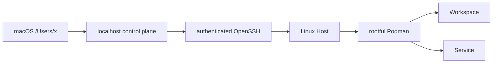
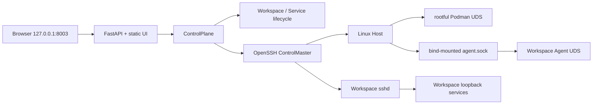
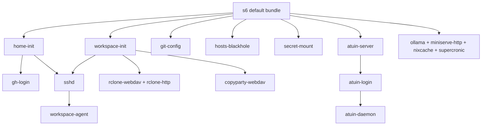
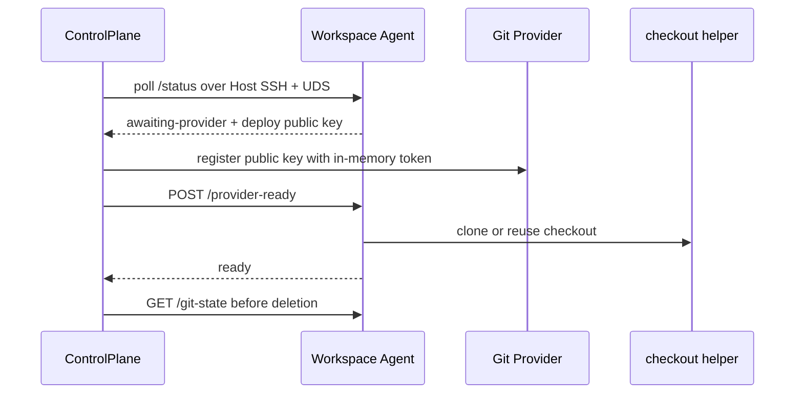
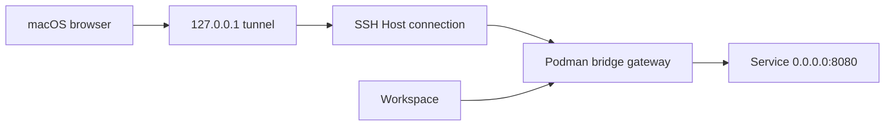

# Codespace Design

Codespace 是个人开发环境的声明式控制面。macOS 是唯一 client，Linux 是唯一受管
remote Host；控制面通过 SSH 连接 Host 上的 rootful Podman，并管理两类容器：

- **Workspace**：Project 的持久开发副本，只运行
  `platform/container/workspace/` 定义的 runtime。
- **Service**：Host 上的单例常驻服务，使用
  `platform/container/services/s6/` 提供的共同基础并尽可能交给 s6 管理生命周期。

代码、manifest、测试与 `Taskfile.yaml` 是实现细节的 source of truth。本文只记录跨
目录才能表达的系统边界、使用流程与开发流程。

## System Model



`Project` 是 Workspace 的配置蓝图，`Workspace` 是 Project 在指定 Host 上的实例。
`Service` 不属于 Project，在每个 Host 上最多存在一个同名实例。配置表达 desired
placement，Podman labels 和 inspect 数据表达 actual state；控制面不使用当前配置补齐
已部署容器缺失的 metadata。

控制面依赖方向是 `web -> control -> workspaces/services -> runtime`。Web 层只负责
HTTP、静态 UI、输入验证和错误映射；`ControlPlane` 统一处理 operation、lifecycle、
日志和 tunnel；领域模块生成 metadata 与 container specification；runtime 只封装
OpenSSH、Podman 和 Host filesystem primitive，不读取配置。

## Install

macOS 环境固定为 `/Users/x`，由 `platform/macos/` 管理。安装器声明 Homebrew、
binman、shell、IDE 与 SSH client 配置，并保持重复执行幂等：

```bash
task platform:macos:install
task sync
```

Host 必须是可通过本机 OpenSSH config 访问的 Linux 环境，并提供 rootful Podman。
控制面使用系统 OpenSSH 复用认证连接，不关闭 host key verification，也不接管 Host
本身的 SSH key、known hosts 或代理链。

## Configure

控制面只读取：

```text
~/.config/codespace/config.yaml
```

从 `config.example.yaml` 创建本机配置后，至少需要完成：

1. 在 `hosts` 声明 Linux SSH Host alias、Podman bridge gateway、image platform 与
   公共 container input。
2. 在 `project_defaults` 声明 Workspace image、可从 Web UI 打开的 tunnel ports、
   environment、secret 与持久 volume。
3. 在 `projects` 声明 source、placement、加密模式与必要的局部覆盖。
4. 在 `services` 声明 image、placement、gateway port publication 与 Service 数据。
5. 在 `tokens` 和 `secrets` 填入私有值；真实配置不得提交到 Git。

YAML 只在进程入口读取并由 Pydantic 完整验证。Project container 按
`project_defaults -> Host -> Project -> placement` 合并，Service container 按
`Host -> Service -> placement` 合并；普通 collection 整体替换，environment 按变量名
合并，volume 按 container target 合并。`${RESOURCE_DATA}` 只可用于 volume source，
解析后必须位于该资源的 Host data root。

所有容器固定使用 Podman bridge mode，配置不提供 network mode 选项。

## Run

前台启动控制面：

```bash
task serve
```

后台重启并写入本机 state/log：

```bash
task serve:bg
```

Web UI 固定监听 `http://127.0.0.1:8003`。它展示 Host、Project、Workspace、
Service 与 operation 状态，并提供 Workspace 创建、Service apply、日志、tunnel 和
删除入口。控制面是 localhost-only、single-process 应用；operation 与临时 tunnel
状态不跨进程持久化。

首次部署前先同步 Podman secret：

```bash
task secrets:sync --
task secrets:sync -- --apply
```

维护命令默认只展示完整计划，只有 `--apply` 才修改远端状态：

```bash
task workspaces:prune --
task workspaces:prune -- --apply
task deploy-keys:prune --
task deploy-keys:prune -- --apply
```

维护任务按 Host 或 repository 隔离失败，只对扫描成功且进入计划的目标执行；Secret
同步还会在每次写入前重查远端状态，plan precondition 改变时拒绝覆盖并要求重新规划。

## Web UI And Execution Flow

Web UI 是控制面进程自带的 FastAPI 应用和原生 HTML、CSS、JavaScript，不存在独立的
frontend build 或 server。应用关闭 OpenAPI、Swagger 和 ReDoc，只在本机提供静态资源
与 JSON API。浏览器不保存 authoritative state；配置、进程内 operation 和各 Host 的
实时 inventory 共同生成 dashboard。



`GET /api/dashboard` 每次都并发查询所有 Host，不使用上次结果伪造在线状态。SSH 连接
失败显示为 `offline`，连接成功后的 inventory 错误显示为 `error`；单个 Host 失败不
阻塞其他 Host。Project 和 Service 配置表达 desired state，Workspace、Service 和
editor link 来自容器 labels 与 inspect 的 actual state。已部署容器缺少 metadata 时
直接报错，不从新配置推断旧状态。

一次写操作按以下流程执行：

1. FastAPI 校验 path、query 和 JSON body，`ControlPlane` 再校验 placement、资源冲突
   与当前 inventory。
2. Workspace create 或 Service apply 先登记 `queued` operation，再由 FastAPI
   background task 调用统一的 deploy lifecycle。operation 只属于当前进程，不支持
   跨进程恢复或并发 worker。
3. lifecycle 解析当前 desired specification，通过复用的 OpenSSH connection 操作
   Host filesystem 和 rootful Podman UDS；Workspace bootstrap 还会经 Host SSH
   转发 bind-mounted Agent UDS。
4. UI 在存在 `queued` 或 `running` operation 时每 1.5 秒刷新 dashboard。为避免破坏
   用户正在复制的命令或日志，页面存在文本选择时跳过本次 render。
5. 成功 operation 从列表移除；失败 operation 保留错误和现场，直到用户显式 dismiss。
   系统不做隐式 rollback。日志接口读取容器的 Podman stdout/stderr，而不是 Workspace
   内部文件日志。

provider token 的更新接口只修改当前控制面内存，dashboard 只返回各 provider 是否已
配置，不返回 token 值。进程重启后重新以配置文件为准。

Workspace tunnel 先校验 Project allowlist 和目标容器的 running 状态，再经 Host SSH
和 Workspace SSH 把随机本机 loopback port 转发到 container loopback。Service tunnel
使用当前 deployment config 中的 bridge gateway `host_ip` 与 published port，经
Host SSH 转发到本机同一 port。两个入口都以 HTTP 303 将浏览器重定向到
`127.0.0.1`；这些 tunnel 随控制面进程关闭。与之不同，创建成功后写入的 Workspace
SSH route 是持久文件，`ssh`、TRAE 和 VS Code 新连接不依赖 Web UI 继续运行。

删除 Workspace 前，UI 先请求 Agent 的 Git deletion check，并展示 uncommitted、
unpushed 或查询失败等风险。检查失败不能当作 clean，但用户仍可显式确认 remove 或
purge。provider Workspace 删除时必须先成功撤销 deploy key，之后才允许删除容器或
data；撤销失败保留完整现场。Service 删除不需要 Git 检查。

## Workspace Runtime

Workspace image 是固定的单用户开发 runtime，用户为 `x`（UID/GID `5230`），PID 1
运行预编译的 s6 service graph。启动项按职责分为：

| 类型 | Service | Contract |
| --- | --- | --- |
| 基础初始化 | `workspace-init`、`home-init`、`git-config`、`hosts-blackhole` | 准备 data、home、Git 和网络策略，非法 managed input 直接失败 |
| Credential | `gh-login`、`atuin-login`、`secret-mount` | credential 不进入 argv 或公共 s6 environment；`secret-mount` 以共享 Podman secret 将配置的 WebDAV 挂到 `/mnt/secret`，挂载失败被记录且不阻塞 bundle |
| 控制入口 | `sshd`、`workspace-agent` | SSH 固定监听 `0.0.0.0:22`；Agent 只监听 `/run/codespace-control` 下的 UDS |
| 本地服务 | `atuin-server`、`rclone-webdav`、`copyparty-webdav`、`ollama`、`rclone-http`、`miniserve-http`、`nixcache` | 只监听 container loopback，使用下表固定端口 |
| 后台任务 | `atuin-daemon`、`supercronic` | 同步 shell history，并执行 image 声明的维护任务 |



| Port | Service | Data contract |
| --- | --- | --- |
| `8002` | Atuin server | history API；数据库在外部，不保存到 image |
| `8004` | rclone WebDAV | `/workspace`、只读 `/logs` 与 `/upload` |
| `8005` | copyparty WebDAV | Workspace、upload 与只读 container logs |
| `8006` | Ollama | Workspace 内模型 API |
| `8007` | rclone HTTP | rclone 数据视图的只读 HTTP 入口 |
| `8008` | miniserve-http | `/var/log` 的只读浏览入口 |
| `8009` | nixcache | Workspace 内 Nix binary cache |

这些 HTTP service 没有独立公网访问 contract；允许从 Web UI 打开的端口必须同时出现在
Project `tunnel_ports`。Atuin credential 只进入 server process，数据库失败只影响
Atuin 依赖链，不阻塞 SSH 与 Agent。控制面日志 API 与 `8008` 用途不同：前者读取
Podman stream，后者查看 s6 写入的文件日志。

业务数据位于 `/workspace`，交换目录位于 `/upload`，Agent control 目录位于
`/run/codespace-control`。普通模式直接 bind mount Workspace 数据；加密模式把相同
Host source 挂到 `/workspace.enc`，由 `workspace-init` 使用 gocryptfs 在
`/workspace` 提供明文视图。encryption 只覆盖业务数据；upload、control 和 IDE cache
保持明文。每个 IDE 只持久化 `bin`、`extensions` 等 cache leaf，image-owned 配置不被
volume 覆盖。

Agent 状态从 `starting` 进入 `ready`；GitHub 或 GitLab source 会先进入
`awaiting-provider`，收到授权后回到 `starting` 并执行 checkout，任意阶段错误进入
`failed`。控制面只通过私有 UDS 调用 `/status`、`/provider-ready` 和 `/git-state`：



deploy private key 在 container 内生成且不离开 Workspace，Agent 只返回 public key。
完整 repository、shallow repository 和已标记的 empty repository 可幂等复用；其他
已存在 target fail-fast，避免覆盖数据。授权只对当前 container 有效，replace 后必须
重新完成 provider handshake。

## Workspace Lifecycle

创建 Workspace 时，控制面按以下顺序执行：

1. 验证 placement、现有 inventory、名称与 forwarding port 冲突。
2. 拉取 Workspace image，在 `~/codespace/workspaces/` 下准备持久目录。
3. 创建 bridge container，并把容器 `0.0.0.0:22` 发布到 Host loopback 的确定性端口。
4. 等待 Workspace Agent 的 UDS bootstrap 状态。
5. 对 provider source 注册容器内生成的 deploy public key，再授权 checkout。
6. 等待 ready，并在 macOS 写入该实例独立的 SSH route。

删除前会读取容器内 Git state。检查失败或存在风险不会伪造 clean 结果；用户仍可显式
确认删除。provider deploy key 必须先撤销成功，普通删除随后只删除容器并保留实例
data，purge 才继续删除 data root。创建或删除中途失败时保留现场和 failed operation，
不隐式回滚。

## Service Lifecycle

Service apply 是 replace reconciliation：拉取 desired image、准备
`~/codespace/services/` 下的 managed data、删除确定性旧容器，再按当前 specification
创建新容器。普通 remove 保留数据，purge 删除对应 data root。

`platform/container/services/s6/` 提供 s6 toolchain、init、默认 bundle 与
supercronic。Debian Service 直接继承该 image；必须使用异构 runtime base 的 Service
从它复制可搬运的 s6 资产，再编译自己的 service graph。每个 leaf 只拥有自身 runtime
资产和 service definition，不复制 Workspace credential、SSH 或控制面逻辑。

Service 的主 listener 固定为容器内 `0.0.0.0:8080`。部署配置把 `8080` 发布到
Podman bridge gateway 的明确地址与 Host port，不允许 loopback 或 wildcard
publication。Workspace 和同 Host Service 通过 gateway 访问；macOS Web UI 通过 SSH
把该 gateway endpoint 转发到本机 loopback。Service 不依赖容器 DNS或 host network。

Service 不需要对外提供端口时仍运行在 bridge mode。`support` 是唯一可挂载 Host
rootful Podman socket 的 Service，权限仅用于 image maintenance。vLLM 与 SGLang
竞争相同 GPU 与 API endpoint，由配置选择其一，控制面不做调度仲裁。

当前复合 Service 还具有以下 image-level contract：

| Service | Contract |
| --- | --- |
| `secret` | WebDAV root 固定为 `/srv`，basic auth 从共享 Podman secret 读取 |
| `chatbox` | 提供静态 SPA，并由同源 `/v1` reverse proxy 访问模型 API；会话数据保存在 browser IndexedDB |
| `lobehub` | 同一容器编排 PostgreSQL 17、应用与自动认证 proxy，持久数据位于 `/var/lib/codespace/lobehub`；`APP_URL` 声明 browser-facing origin，共享 browser session 构成 single-user trust boundary |
| `vllm`、`sglang` | 使用固定的 8x H100 runtime profile，并竞争同一个模型 endpoint |
| `support` | 唯一 Podman socket consumer，只执行 image pull 与 prune maintenance |

## Network And Access



Workspace 的 SSH publication 是唯一 Host loopback publication。Workspace 内无认证
的 file/log service 固定监听 container loopback，只能经 Workspace SSH tunnel 或容器
内进程访问。Project 的 `tunnel_ports` 是允许转发的 container loopback port allowlist。

每个 Host 只声明一个 `bridge_gateway`；该 Host 上所有 Service port 的 `host_ip` 必须
与它完全一致。gateway address 和 published port 属于 Host deployment config，不固化
进 image。公网或 LAN 暴露不在 Codespace contract 中。

Host DNS、bridge gateway、IPv6 出站与 GPU runtime 属于基础设施前提。配置变化只影响
后续创建或 apply 的容器，不迁移已有容器。

## Security

- provider token 只存在于 macOS 配置和控制面内存，不进入容器。
- deploy private key 只在 Workspace 容器内生成；Agent 只返回 public key。
- Agent 只通过 SSH 转发的私有 UDS 暴露，不监听 TCP。
- rootful Podman socket 等同 Host root 权限，只允许明确拥有该职责的组件访问。
- Workspace 加密必须显式启用，缺少 key 时 fail-fast，不降级为明文。
- Service secret 使用 Podman secret；共享 secret 的 consumer 必须使用相同固定路径和
  最小读取权限。

## Images

所有 OCI build 使用 repository root 作为 context。Workspace image 由独立 toolchain
stage、rootfs、Agent 与 build-time image tests 组成；发布 stage 依赖测试 marker，
验收失败时不产出 image。Service image 通过统一 workflow 构建，leaf Dockerfile
保存精确版本、构建依赖和不可从命令直接读出的兼容性理由。

`platform/container/workspace/rootfs/` 同时拥有 system 配置、s6 definition 和共享
home source；重复的 editor 配置使用相对 symlink，macOS installer 以相同路径暴露这套
home source。s6 database 与 container init 在 image build 时生成，不在启动时动态
编译。

Framework image 只提供可运行或可 import 的计算环境，不承担 Service 生命周期。
WSL artifact 复用 Workspace filesystem，但它是本地 distribution，不是控制面支持的
remote Host。OCI image 在发布时被压平为 WSL rootfs，entrypoint 与 image environment
都会丢失，因此启动 wiring 必须存在于 filesystem。

WSL 的 PID 1 固定为 Microsoft `/init`，不能复用要求 PID 1 的 container init。
`boot.sh` 直接建立 s6 supervision tree，等待 `s6-svscan` ready 后初始化 s6-rc，并只
启动 WSL bundle。该 bundle 复用 Workspace 的 home、data 和 sshd dependency，但不
启动需要控制面 bootstrap 的 Workspace Agent；数据与 IDE state 直接保存在
distribution filesystem。SSH 的 LAN 可达性由 Windows mirrored networking 或
NAT portproxy/firewall 负责，distribution keep-alive 也属于 Windows 配置，不属于
Codespace 控制面。

可用构建入口以 `task --list` 为准，常用入口包括：

```bash
task platform:workspace
task platform:s6
task platform:<service>
task platform:framework:<framework>
task platform:wsl
```

## Development

安装锁定依赖后，日常循环运行：

```bash
task sync
task check
```

行为改动需要补充聚焦测试。提交前运行：

```bash
task check:full
```

`task check` 依次覆盖 format check、Ruff、ShellCheck、strict Mypy 与 lock 校验；
`task check:full` 额外运行 Python 和 macOS installer tests。Workspace image contract
不会由普通单测构建，修改其 filesystem、权限、s6 graph 或 runtime helper 后还必须
运行：

```bash
task platform:workspace
```

修改 s6 base 时验证所有 Service leaf；修改共享 home 或 SSH trust material 时同时
验证 Workspace image 与 macOS installer。声明式操作必须幂等，非法输入必须
fail-fast，不保留旧 schema、路径、label、tag、route、alias 或 fallback。
