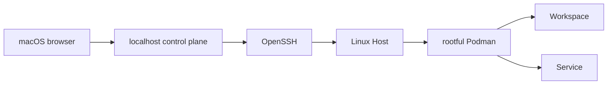

# Codespace Design

Codespace 是个人开发环境的声明式控制面。macOS 是唯一 client，Linux 是唯一受管
remote Host；控制面通过本机 OpenSSH 连接 Host 上的 rootful Podman。

代码、配置 schema、container manifest、测试与 `Taskfile.yaml` 是实现细节的
source of truth。本文只记录跨目录才能表达的系统边界、状态模型和操作约束，不维护
镜像内部端口、版本、service graph 或工具清单。

## System Model



- **Project** 是 Workspace 的配置蓝图。
- **Workspace** 是 Project 在指定 Host 上的命名实例，拥有持久数据、SSH 入口和
  可选 repository checkout。
- **Service** 是 Host 级单例，由配置描述 image、placement 和 container inputs。
- **WSL** 复用 Workspace filesystem 生成本地 distribution，但不属于控制面管理的
  remote Host。

配置表达 desired state；Podman labels 与 inspect 数据表达 actual state。控制面不会
用当前配置补齐已部署容器缺失的 metadata，也不会自动迁移因配置变化而过时的容器。

## Ownership

| Path | Responsibility |
| --- | --- |
| `src/codespace/web/` | localhost HTTP boundary、静态 UI、输入验证与错误映射 |
| `src/codespace/control.py` | inventory、operation、lifecycle、日志与 tunnel 编排 |
| `src/codespace/workspaces/` | Workspace metadata、specification、Agent、provider 与 SSH route |
| `src/codespace/services.py` | Service metadata、specification 与 inventory |
| `src/codespace/runtime/` | OpenSSH、Podman 与 Host filesystem primitives |
| `src/codespace/maintenance/` | 可审计的 plan/apply 维护命令 |
| `platform/container/` | Workspace、Service 与 framework OCI artifacts |
| `platform/macos/` | 固定 macOS 用户环境与安装器 |
| `platform/wsl/` | WSL image、导出与 Windows 侧配置 |

控制面依赖方向是 `web -> control -> workspaces/services -> runtime`。Web 层不拥有业务
状态，runtime 不读取应用配置，container image 不包含控制面逻辑。

## Configuration And State

控制面只读取 `/Users/x/.config/codespace/config.yaml`。`config.example.yaml` 展示当前
完整 schema；真实 token 与 secret 不得提交到 Git。

配置在进程入口一次性读取并由 Pydantic 转换为 immutable model：

- `hosts` 声明 SSH Host、需要转发的环境变量和 Host container override。
- `project_defaults` 提供所有 Workspace 的默认 encryption、tunnel allowlist 与
  Compose service input。
- `projects` 和 `services` 的 `hosts` 只声明 placement，不提供 Host-specific resource
  override；Host 差异写入 Host，资源差异写入 Project 或 Service。
- Project container 按 `project_defaults -> Host -> Project` 合并，Service container
  按 `Host -> Service` 合并。environment 按变量名合并，volume 按 source 或 target
  替换，其余 collection 整体替换。
- `container` 使用受支持的 Compose service 字段，包括 `image`、`platform`、
  `pull_policy`、`network_mode`、`restart`、environment、mount、secret 与 resource
  limit。完成 layer merge 和动态资源解析后，runtime 只做一次到 podman-py kwargs
  的机械映射；配置不使用 Podman 专有字段名。
- volume source 为绝对路径或 `${RESOURCE_DATA}` 时是 Host bind，`${RESOURCE_DATA}`
  在部署时解析到该资源的 Host data root，任何解析结果都不得逃逸该目录；其余
  source 视为 named Podman volume（如 `codespace-resource`）。

Host 上的持久数据统一位于 `$HOME/codespace/`。普通 remove 保留数据，只有 purge
才删除对应资源目录。Workspace 的业务数据是否加密由 Project 最终配置决定；加密只
覆盖业务数据，不隐式覆盖 control socket 或 IDE cache。

## Control Plane

Web 应用固定监听 `http://127.0.0.1:8003`，single process、single worker 运行。dashboard
每次查询所有 Host 的实时 inventory；SSH 失败标记为 `offline`，连接后的 inventory
失败标记为 `error`，单个 Host 失败不阻塞其他 Host。

写操作先登记 process-local operation，再由 background task 执行。成功后 operation
移除；失败时保留错误和当前现场，直到用户 dismiss。系统不提供跨进程恢复、并发
worker 协调或隐式 rollback。

Workspace create 的核心顺序是：

1. 校验 placement、identity、现有 inventory 与确定性 SSH port 冲突。
2. 按最终 Compose service 拉取 image、准备 Host data root 并创建 container。
3. 通过 bind-mounted Unix socket 等待 Workspace Agent。
4. provider source 注册 Workspace 内生成的 deploy public key，再授权 checkout。
5. Agent ready 后在 macOS 写入持久 SSH route。

Workspace create 不替换同 identity 的现有实例。删除 provider Workspace 时必须先
成功撤销 deploy key；删除前的 Git 检查失败不能伪装成 clean，但用户可显式确认
remove 或 purge。

Service apply 使用 replace reconciliation：先拉取 image 并准备数据，再删除旧容器并
按当前 specification 创建新容器。apply 失败保留现场，不恢复旧容器。Service remove
允许资源尚未部署，Workspace remove 则要求目标容器存在。

## Connectivity And Security

每个 Host 使用一个复用的 OpenSSH ControlMaster。该连接承载 Podman Unix socket、
Host command 和 Workspace Agent socket forwarding；用户服务 tunnel 使用独立受控的
SSH process，并随控制面进程关闭。

控制面沿用系统 OpenSSH config、host key verification、credential 与代理链，不接管
Host 登录材料。

默认配置使用 Podman bridge mode：

- 同一 Host 上的容器间请求使用默认 `podman` network 的 DNS，以
  `codespace-service-<service>:<target-port>` 访问；被调用服务监听 container
  `0.0.0.0`，但不为内部通信配置 Host port publication。
- Workspace SSH 只发布到 Host loopback；Workspace 内 HTTP service 应监听 container
  loopback，并且只有 Project `tunnel_ports` 中的端口可由 Web UI 打开。
- Workspace 的 source metadata、转发环境变量和确定性 SSH publication 由实例 identity
  在创建前合入最终 container spec；encryption secret mount 必须显式写入配置。
- Service 的 `container.ports` 仅声明需要固定 Host port 的入口，不用于容器间服务
  发现；`tunnel_ports` 与 Workspace 一样声明 Web UI 可打开的容器 TCP port。没有显式
  publication 的 tunnel port 在部署时自动绑定到 Host loopback 随机端口，避免同一
  Host 上多个 Service 的端口冲突。所有 publication 必须绑定 Host loopback；schema
  拒绝 wildcard、bridge gateway、LAN 或公网地址。
- Service port 冲突最终由 Podman apply 结果判定。

默认 `podman` network 是 Host-local 的共享信任域：DNS 名只在同一 Host 上有效，
Service replacement 期间允许短暂解析或连接失败，调用方必须容忍目标尚未 ready。
需要隔离不同容器时应调整网络模型，不能把 DNS 名当作访问控制。

安全边界如下：

- provider token 只存在于 macOS 配置和控制面内存，不进入 Workspace。
- deploy private key 在 Workspace 内生成且不离开容器，Agent 只返回 public key。
- Workspace Agent 只监听 bind-mounted Unix socket，不开放 TCP。
- Podman secret 在使用前必须显式同步；缺少 encryption key 时 Workspace fail-fast，
  不降级为明文。
- rootful Podman socket 等同 Host root 权限，只能挂载给明确拥有 Host maintenance
  职责的 Service。

## Images And Platforms

Workspace image 是固定单用户 runtime，PID 1 运行 build-time 编译的 s6 service
graph。`platform/container/workspace/rootfs/` 拥有 system 配置、service definition
与共享 home source；运行期只初始化数据和 credential，不动态编译 image contract。

Host 上的 rootful Podman 与 Workspace 内的 rootless Podman 是两个独立边界。前者由
控制面管理 Workspace 生命周期；后者只服务 Workspace 用户 `x`，API socket 位于
`/run/user/5230/podman/podman.sock`，不能用于管理 Host container。内部 Podman 的 bundle、
wrapper、配置与 s6 service 由 Workspace image 独占，不进入共享 BM profile。
`/opt/podman/data` 是唯一持久状态边界：未挂载时状态随 Workspace container 消失；
挂载 `${RESOURCE_DATA}/podman` 后随 Workspace 数据保留。全新 data 根据 backing
filesystem 选择 native overlay 或 VFS；已有 graphroot 沿用原 driver，不做迁移。

`platform/container/services/s6/` 提供 Service 共用的 s6 runtime。Debian leaf 可以
直接继承；异构 base 只复制可搬运资产并编译自己的 graph。每个 Service leaf 只拥有
自身 runtime 资产，不复制 Workspace SSH、credential 或 Agent 逻辑。Framework
image 只提供计算环境，不承担 Service lifecycle。

macOS installer 管理固定 `/Users/x` 环境并保持重复执行幂等。WSL artifact 从
Workspace image 导出 flat rootfs，因此 OCI entrypoint 与 image environment 不会保留；
WSL 使用 Microsoft `/init`，再由 filesystem 中的 boot wiring 启动专用 s6 bundle。

## Operations

安装与启动：

```bash
platform/macos/install.sh
task sync
task serve
task serve:bg
```

维护命令默认只打印完整计划，只有 `--apply` 修改远端状态：

```bash
task secrets:sync --
task secrets:sync -- --apply
task resources:sync --
task resources:sync -- --apply
task workspaces:prune --
task workspaces:prune -- --apply
task deploy-keys:prune --
task deploy-keys:prune -- --apply
```

维护任务并发处理 Host 或 repository，任一目标失败即终止命令，不基于不完整 inventory
继续清理。未配置 provider token 的 repository 会显示 warning 并跳过。Secret 同步在
同一 Host 连接内完成状态检查和可选写入。
`resources:sync` 把 `project_defaults.resource_image` 指定的 payload-only image
拷入每台 Host 的 named volume `codespace-resource`（Workspace 只读挂载到
`/opt/resource`）。volume 内的 `.codespace-resource-digest` 记录填充时的 OCI image
digest；`--apply` 先拉取 image，再比较 Host 最新 image digest，一致时跳过，
`--force` 强制重填。

## Development

日常验证入口：

```bash
task check
task check:full
```

`task check` 覆盖 format check、Ruff、ShellCheck、strict Mypy 与 lock 校验；
`task check:full` 额外运行 Python 和 macOS installer tests。

修改 artifact 时还需运行其所属目录的 build 或 export 验证。Workspace filesystem、
权限、s6 graph 或 runtime helper 的变更至少运行
`platform/container/workspace/build.sh`；共享 s6 base 变更验证所有 Service leaf；
共享 home 或 SSH trust material 变更同时验证 Workspace image 与 macOS installer；
WSL boot 变更验证 build、export、import、boot 与 SSH。
