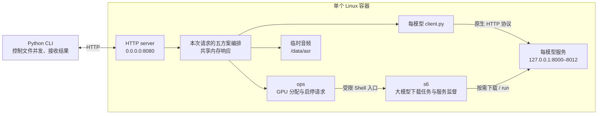
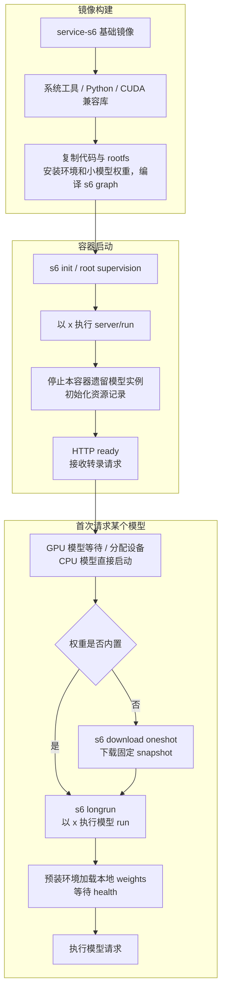
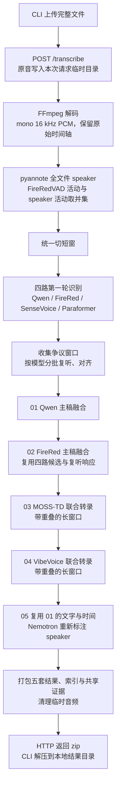
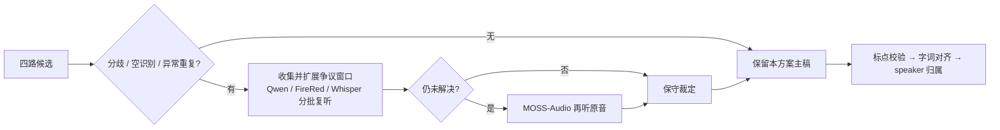
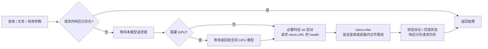

# Chinese Recording Transcription

把完整的普通话对话录音转成**带时间戳、说话人和待核对标记的原话记录**。
每个文件固定产出 **5 份 Markdown + 5 份 JSON + 索引 + 共享证据**，一次 HTTP 请求
处理完成后返回一个 zip。中文为主，保留夹杂英文、语气词、重复和插话。

| 输入 | 处理 | 输出 | 部署 |
| --- | --- | --- | --- |
| 完整录音文件或目录 | VAD → 多模型识别与复核 → 标点 / 对齐 / speaker | 五套转录文档及证据 JSON | 一个 Linux 容器 + Python CLI |

不处理粤语、实时流、翻译、摘要或跨文件身份识别；不需要网页、数据库或外部队列。
维护入口是 [AGENTS.md](AGENTS.md)，模型参数的原因和约束直接写在实现旁的注释中。

## Architecture



| 层次 | 拥有的职责 | 交互方式 |
| --- | --- | --- |
| 上层 `server/` | 一次请求内的音频处理、五方案、文字选择、时间与身份、产物 | 调用模型 client，不导入模型 SDK |
| 底层 `models/<model>/` | 本模型权重、Python 环境、参数、服务与 HTTP 协议 | 官方支持时原生 vLLM；其余用官方 SDK |
| 运维 `ops/` + `rootfs/` | GPU 池、按需启停、进程监督、用户与日志 | ops 请求 s6 操作，s6 执行静态脚本 |

每模型一个实例、一个固定端口、一个独立 uv 环境。GPU 数量影响等待和并行度；
多个方案共享实例，不要求全部模型同时驻留，也不绑定物理卡号。
文件并发由 CLI 控制。服务端没有文件队列、任务 ID、状态查询、重启恢复或跨请求缓存。

## Project Layout

```text
asr/
├── DESIGN.md                 # 架构与执行流程
├── AGENTS.md                 # 维护约定、框架兼容与验证边界
├── Dockerfile
├── protocol.py               # 请求、时间片与结果契约
├── client/asr.py              # 独立 Python CLI
├── server/
│   ├── run / server.yaml      # HTTP 入口 / 编排配置
│   ├── api.py / transcribe.py # HTTP 请求 / 完整文件处理
│   ├── audio.py / recipes.py  # 音频处理与五方案
│   └── inference.py / transcript.py / artifacts.py
├── models/
│   ├── catalog.py            # 模型能力、时长限制与资源预算
│   ├── vllm.py               # vLLM 响应完成状态解析
│   └── <model>/
│       ├── pyproject.toml / uv.lock / .python-version
│       ├── download_model.sh # 固定 repo / revision，构建或运行时下载
│       ├── run               # 监听地址、端口及模型启动参数
│       ├── client.py         # 固定服务地址、请求与结果解析
│       ├── service.py        # 仅 SDK / 特殊 pooling 接口需要
│       └── .venv/ / weights/ # 镜像构建生成环境；权重按模型选择构建或运行时下载
├── ops/                      # GPU inventory、调度与进程操作
├── rootfs/
│   ├── etc/s6/s6-rc.d/        # 全部静态 s6 定义
│   ├── etc/sudoers.d/asr
│   └── usr/local/bin/asr-model-service
└── tests/
```

## Model Services

13 个模型分工如下，**11 个常规使用，2 个仅在争议时复核**。端口按目录名顺序约定，
直接写在各模型的 `run` 与 `client.py`，调度器不生成端口。所有模型只监听 loopback，
对外仅发布 HTTP server 的 `8080`。

| 端口 | 模型目录 | 模型 / 职责 | Serving |
| --- | --- | --- | --- |
| 8000 | `firered-llm` | FireRedASR2-LLM：第二主稿与交叉校验 | vLLM transcription |
| 8001 | `firered-punc` | FireRedPunc：融合稿标点 | FireRed SDK / CPU |
| 8002 | `firered-vad` | FireRedVAD：语音活动范围 | FireRed SDK / CPU |
| 8003 | `moss-audio` | MOSS-Audio-8B-Instruct：仍有争议时复听 | vLLM audio chat |
| 8004 | `moss-td` | MOSS-Transcribe-Diarize：联合文字、时间和 speaker | vLLM transcription |
| 8005 | `nemotron-diarization` | Nemotron-3-Diarization：独立 speaker 结果 | NeMo SDK |
| 8006 | `paraformer` | Paraformer-zh：独立中文校验 | FunASR SDK |
| 8007 | `pyannote-community-1` | pyannote：全文件身份与跨窗映射 | pyannote.audio SDK |
| 8008 | `qwen3-aligner` | Qwen3-ForcedAligner-0.6B：定稿字词时间 | vLLM pooling + 本模型 HTTP |
| 8009 | `qwen3-asr-1.7b` | Qwen3-ASR-1.7B：第一主稿与交叉校验 | vLLM transcription |
| 8010 | `sensevoice` | SenseVoiceSmall：独立中文校验 | FunASR SDK |
| 8011 | `vibevoice` | VibeVoice-ASR-HF：另一套联合转录 | vLLM audio chat |
| 8012 | `whisper-large-v3` | Whisper large-v3：争议区间复听 | vLLM transcription |

## Image Startup Pipeline



| 时机 | 实际行为 |
| --- | --- |
| 构建镜像 | 安装 server、全部模型环境，以及选定小模型权重；gated 权重使用 build secret |
| 首次启动内置模型 | 直接启动 service，不访问 HF |
| 首次启动其余模型 | `download → service`；两个脚本使用预装环境，不解析或安装依赖 |
| 同一容器再次启停 | 已完成的 runtime download job 不重跑；`run` 加载本地权重 |
| 容器重建 | 内置权重复用 image layer；其余模型由 runtime download job 重新确认 |
| 显存不足 | FIFO 等待；必要时停止本容器无在途请求的模型，确认退出后释放资源 |
| 模型退出 | s6 管理停止超时；finish 清理残留子进程后才重启，ops 等待完整退出 |

s6 负责进程与依赖，ops 负责资源分配。模型固定使用 `/data/asr` 读取音频，GPU 服务
仅接收动态 `CUDA_VISIBLE_DEVICES`；端口、路径、精度等参数均在模型目录内维护。

## Request Pipeline

一个文件按下图执行；五套方案共享本次请求内的计算。CLI 用 `--parallel` 限制文件
并发，每个模型一次处理一个调用。HTTP 连接保持到完整结果返回，不需要轮询。



`--separate-channels` 对独立录制的声道分别执行流程，再合并成相同五套产物；
speaker 加声道前缀。`--vad-off` 使用全文活动范围。默认不降噪、不做音源分离。

| 方案 | 正文来源与复核 | Speaker | 定稿后处理 |
| --- | --- | --- | --- |
| `01-qwen-fusion` | Qwen 主稿；FireRed / SenseVoice / Paraformer 校验，争议时复听 | 全文件 pyannote | FireRedPunc → Qwen aligner → 按字词活动分配身份 |
| `02-firered-fusion` | FireRed 主稿；共享四路候选和复听响应，独立裁定 | 共享 pyannote | 同 `01`，正文不同时重新对齐 |
| `03-moss-td` | MOSS-TD 原生正文；已有四路分歧只用于标记 | 局部标签通过 pyannote 映射到全文件身份 | 保留原生标点和片段时间，Qwen aligner 补字词时间 |
| `04-vibevoice` | VibeVoice 原生正文；已有四路分歧只用于标记 | 同 `03` | 同 `03` |
| `05-qwen-nemotron` | 直接复用 `01`，不重新识别或对齐 | Nemotron 全文件处理，最多 8 个身份 | 仅重新分配 speaker；间接继承 `01` 的切分依据 |

### Fusion And Review



每个复核模型先处理整批窗口，再集中对齐到原窗口范围。前几路复核仍不一致的窗口
才交给 MOSS-Audio；两份融合稿共享复核响应，各自以自己的主稿裁定。

| 质量约束 | 行为 |
| --- | --- |
| 文字替换 | 主模型复听也改口且有独立家族支持才考虑替换；数字、热词、专名启发式和多人活动窗口受保护 |
| 证据不足 | 保留主稿和待核对标记；多个同家族响应不增加独立票数 |
| 时间戳 | 全部还原为原录音整数毫秒；无效字词时间用 `null`，不平均摊分 |
| Speaker | 可多人或未知；联合窗口映射有歧义时保持未知，不凭相同标签合并身份 |
| 标点 | 仅允许标点变化；不得改写数字、大小写、空格和口语内容 |
| 联合输出 | 截断、结构错误、越界或明显漏尾须缩窗重试；无法安全对齐边界则报失败 |

多模型用于保留不同路线和发现分歧；一致、流畅或对齐成功都不能证明识别正确。

## Model Call Pipeline



同一请求按模型、切片路径与有效参数复用响应。请求间只共享驻留模型，不复用识别
结果。CPU 服务不进入 GPU 队列。模型原始响应统一导出到一份 `evidence.json`。

## Output And Usage

```text
texts/<录音相对路径与文件名>/
├── 01-qwen-fusion.md / .json
├── 02-firered-fusion.md / .json
├── 03-moss-td.md / .json
├── 04-vibevoice.md / .json
├── 05-qwen-nemotron.md / .json
├── index.md                  # 各方案完成情况与链接，不做排名
└── evidence.json             # 一份共享原始响应、复核依据和请求参数
```

Markdown 展示原话、时间、speaker 与待核对标记；JSON 保留候选、裁定和失败说明，
通过 `evidence` 字段引用共享证据。复制单份 JSON 时一并携带 `evidence.json`。

普通话识别的质量检查保留：某个方案的模型失败时，该稿记录失败，其余可完成稿仍
一起返回；解码、公共 speaker 等前置环节失败则本次 HTTP 请求失败。CLI 仅在完整接收
并解压后发布结果目录，不保存任务状态。请求中断后重新执行；已有结果用 `--overwrite`
重新转录并覆盖。`/data/asr` 只需提供临时音频空间，不需要持久任务卷。

```bash
uv run platform/container/services/asr/client/asr.py ./recordings \
  --server http://asr-host:8080 \
  --out ./texts \
  --parallel 2
```
