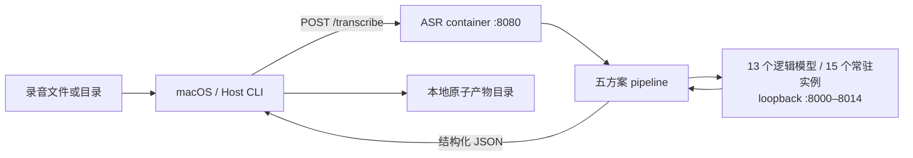
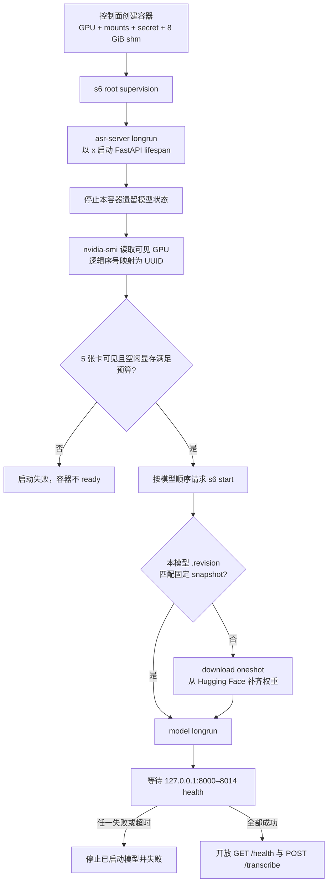
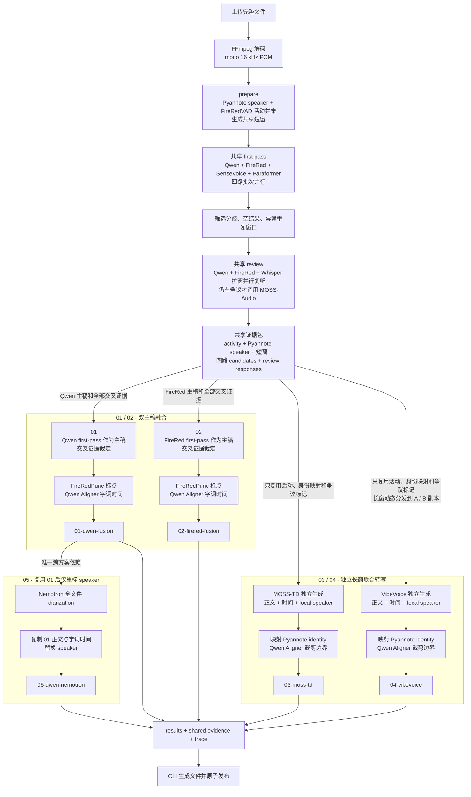

# ASR Service Design

本服务把完整的普通话对话录音转成带时间戳、说话人和待核对标记的原话记录。每个输入
固定产出 5 份 Markdown、5 份 JSON、索引、共享证据和执行追踪。它面向离线文件，不处理
实时流、翻译、摘要、粤语或跨文件身份识别。



控制面只部署一个 Linux Service container。容器内的 server 拥有请求期编排，s6 拥有模型
进程生命周期；模型权重、请求临时空间与客户端产物彼此分离。实现维护入口见
[AGENTS.md](AGENTS.md)。

## Service Startup

容器只有在全部 15 个模型实例通过 health check 后才对外 ready。模型部署是启动期的一次性
动作，请求期间不下载权重、不启停模型，也不重新排布 GPU。



| 阶段 | Owner | 写入状态 | 失败语义 |
| --- | --- | --- | --- |
| 容器资源注入 | 控制面 / Podman | devices、mount、secret、shared memory | 缺少设备、目录或 secret 时容器不能完成启动 |
| GPU 映射 | `server/ops` | `/run/asr/<instance>/CUDA_VISIBLE_DEVICES` 与 `PORT` | 卡数、空闲显存或 placement 不满足即整体失败 |
| 权重准备 | s6 download oneshot | `/model-data/<model>` 与 `.revision` | 固定 snapshot 未就绪则对应模型不启动 |
| 模型驻留 | s6 model longrun | GPU / CPU memory 与 loopback listener | 任一模型 health 超时即回收已启动模型 |
| API ready | FastAPI lifespan | 无持久状态 | 只有全部模型 ready 后才接受请求 |

s6 以 root 监督，server、download 与 model process 均以固定用户 x 运行。停止时 s6 并行
终止 graph；每个 model 的 `finish` 清理残留 engine 子进程，server 只关闭自己的 HTTP
client，避免和 graph teardown 竞态。

## Request Execution Flow

一个文件对应一个长连接 HTTP 请求。CLI 的 `--parallel` 控制文件级并发；容器内不同模型
可以并行；逻辑模型由实例池选择空闲副本，每个实例最多一个在途调用。相同模型、切片与有效参数只在当前请求
内复用，跨请求没有任务队列、结果缓存或恢复状态。



图中的 01–04 都从同一个共享证据包出发并同时执行；唯一跨方案依赖是
05 复制已完成的 01。03 / 04 的正文由各自联合模型重新生成，共享 first pass 只用于质量
标记和 identity 映射，不参与替换其正文。05 在 01 完成后立即启动，不等待 02–04。

| 共享阶段 | 并发 / 复用 | 主要约束 |
| --- | --- | --- |
| upload / decode | 每请求一次；CPU semaphore | 原音写入请求临时目录，解码保留原始时间轴 |
| prepare | pyannote 后 FireRedVAD | speaker 活动与 VAD 取并集；`--vad-off` 使用全文 |
| first pass | 4 个模型批次并行；各模型逐窗串行 | 候选互不喂答案，使用相同短窗 |
| review | Qwen / FireRed / Whisper 三批并行，随后按需 MOSS-Audio | 扩窗响应重新对齐到原窗口；同家族不增加独立票数 |
| response / publish | server 返回一次 JSON；CLI 在临时目录生成全部文件 | 只有完整接收并写完后才替换目标目录 |

| 方案 | 独立正文来源 | 复用内容 | 本方案独有处理 | 最终 speaker / 时间 |
| --- | --- | --- | --- | --- |
| 01 Qwen fusion | Qwen first-pass 短窗主稿 | 四路 candidates、全部 review、Pyannote speaker | 交叉证据裁定；FireRedPunc；Qwen Aligner | Pyannote speaker；重新对齐的字词时间 |
| 02 FireRed fusion | FireRed first-pass 短窗主稿 | 与 01 相同，但不读取 01 定稿 | 独立裁定；FireRedPunc；Qwen Aligner | Pyannote speaker；重新对齐的字词时间 |
| 03 MOSS-TD | MOSS-TD 长窗联合输出 | activity 尾部检查、Pyannote identity 映射、first-pass 争议标记 | 保留自身正文、时间和 local speaker；失败最多缩窗两层 | local speaker 映射到全局身份；Aligner 只裁剪重叠边界 |
| 04 VibeVoice | VibeVoice 长窗联合输出 | 与 03 相同，但不读取 03 或融合稿 | 保留自身正文、时间和 local speaker；失败最多缩窗两层 | local speaker 映射到全局身份；Aligner 只裁剪重叠边界 |
| 05 Qwen + Nemotron | 完整复制 01 正文与字词时间 | 仅依赖已完成的 01；不重新 ASR | Nemotron 对全文件独立 diarization，仅重新切分 speaker | Nemotron speaker；正文和字词时间保持 01 不变 |

模型调用先查请求内缓存，再以逻辑模型、切片与有效参数做 single-flight，最后从实例池取得副本；
因此副本数增加不会让相同调用重复推理。vLLM 流必须收到标准 SSE 的 `[DONE]`，且所有 completion 都以 `stop`
结束；截断响应不能进入融合。

## Persistent Data And Mounts

| Host / runtime source | Container path | Mode | 生命周期与内容 |
| --- | --- | --- | --- |
| `${RESOURCE_DATA}/models` | `/model-data` | 正常部署 rw；预下载测试可 ro | 13 个固定 snapshot、HF metadata 与 `.revision`；跨 image / container 保留 |
| `${RESOURCE_DATA}/requests` | `/data/asr` | rw，UID/GID `5230:5230` 可写 | 上传原音、解码 WAV 和切片；语义上是临时空间，正常与可处理异常请求都清理 |
| Podman secret `huggingface_token` | `/run/secrets/huggingface_token` | ro，x 可读 | 仅 marker 缺失或 revision 改变时读取，不写入 image 或 model-data |
| Podman private shared memory | `/dev/shm` | rw，8 GiB | FireRed tensor parallel / NCCL 的进程间通信；不持久化 |
| 容器内部 tmpfs / writable layer | `/run/asr` | rw | 启动期 GPU UUID 环境文件；容器替换即消失 |
| CLI 所在机器的 `--out` | 不挂入容器 | client-owned | 最终 14 个文件；server 不拥有用户结果目录 |

`/opt/asr` 只包含代码与预装环境，不能被 volume 遮蔽。没有 `/model-data` mount 时权重会
落入容器 writable layer 并随容器替换丢失，因此不属于受支持的持久部署形态。

## Model Inventory And Deployment

全部模型在启动期常驻。下表是模型 checkpoint、请求职责、Serving、Runtime Stack、部署与
存储体积的唯一汇总视图，不在 `AGENTS.md` 另建版本分组表。GPU 是容器可见设备的逻辑序号，
显存是 `models/catalog.py` 声明的每卡静态预算；Python 与依赖版本来自各模型 lock 的 Linux
解析结果。CUDA 指 toolkit release，CPU-only 记为 `—`。Checkpoint 与 `.venv` 大小均为
二进制 GiB，权重全部外置。

| 模型 / checkpoint | 端口 | 阶段 / 职责 | Serving 接口 | SDK / runtime | Python | Transformers | vLLM | Torch | CUDA | 部署 | 显存预算 / 卡 GiB | Checkpoint GiB | `.venv` 逻辑 GiB |
| --- | ---: | --- | --- | --- | --- | --- | --- | --- | --- | --- | ---: | ---: | ---: |
| [`firered-llm`](https://huggingface.co/allendou/FireRedASR2-LLM-vllm) | 8000 | first pass / review；第二主稿 | transcription（[作者配方][firered]） | — | 3.12.14 | 5.17.0 | 0.31.0 | 2.13.0 | 13.0.3 | GPU 0+1，TP=2 | 32 | 31.147 | 7.392 |
| [`firered-punc`](https://huggingface.co/FireRedTeam/FireRedPunc) | 8001 | 01 / 02；标点校验 | 本模型 HTTP | [FireRedASR2S][firered] 0.0.1 @ `4e7d9aa` | 3.12.14 | 5.1.0 | — | 2.10.0+cpu | — | CPU | — | 0.762 | 0.832 |
| [`firered-vad`](https://huggingface.co/FireRedTeam/FireRedVAD) | 8002 | prepare；语音活动范围 | 本模型 HTTP | [FireRedASR2S][firered] 0.0.1 @ `4e7d9aa` | 3.12.14 | 5.1.0 | — | 2.10.0+cpu | — | CPU | — | 0.002 | 0.832 |
| [`moss-audio`](https://huggingface.co/OpenMOSS-Team/MOSS-Audio-8B-Instruct) | 8003 | review；残余争议复听 | audio chat（[作者文档][moss-audio]） | — | 3.12.14 | 5.17.0 | 0.31.0 | 2.13.0 | 13.0.3 | GPU 0 | 32 | 16.862 | 7.392 |
| [`moss-td`](https://huggingface.co/OpenMOSS-Team/MOSS-Transcribe-Diarize) | 8004 | 03；联合正文、时间、speaker | transcription（[作者文档][moss-td]） | — | 3.12.14 | 5.17.0 | 0.31.0 | 2.13.0 | 13.0.3 | GPU 2 | 48 | 1.692 | 7.396 |
| [`nemotron-diarization`](https://huggingface.co/nvidia/Nemotron-3-Diarization) | 8005 | 05；独立 speaker 重标 | 本模型 HTTP | NeMo 3.1.0+ca3f93a51 | 3.12.14 | 4.57.6 | — | 2.13.0 | 13.0.3 | GPU 1 | 12 | 0.185 | 5.288 |
| [`paraformer`](https://huggingface.co/funasr/paraformer-zh) | 8006 | first pass；中文旁路校验 | 本模型 HTTP | [FunASR][funasr] 1.4.16 | 3.12.14 | 4.57.6 | — | 2.13.0 | 13.0.3 | GPU 4 | 4 | 0.820 | 4.973 |
| [`pyannote-community-1`](https://huggingface.co/pyannote/speaker-diarization-community-1) | 8007 | prepare；全文件身份与跨窗映射 | 本模型 HTTP | [pyannote.audio][pyannote] 4.0.7 | 3.12.14 | — | — | 2.13.0 | 13.0.3 | GPU 1 | 6 | 0.031 | 4.819 |
| [`qwen3-aligner`](https://huggingface.co/Qwen/Qwen3-ForcedAligner-0.6B) | 8008 / 8013 | review / finalize；字词时间 | pooling + 本模型 HTTP（[Qwen SDK][qwen]） | — | 3.12.14 | 5.17.0 | 0.31.0 | 2.13.0 | 13.0.3 | GPU 4 review / GPU 0 recipe | 8 | 1.709 | 7.396 |
| [`qwen3-asr-1.7b`](https://huggingface.co/Qwen/Qwen3-ASR-1.7B) | 8009 | first pass / review；第一主稿 | transcription（[Qwen SDK][qwen]） | — | 3.12.14 | 5.17.0 | 0.31.0 | 2.13.0 | 13.0.3 | GPU 2 | 12 | 4.376 | 7.392 |
| [`sensevoice`](https://huggingface.co/FunAudioLLM/SenseVoiceSmall) | 8010 | first pass；中文旁路校验 | 本模型 HTTP | [FunASR][sensevoice] 1.4.16 | 3.12.14 | 4.57.6 | — | 2.13.0 | 13.0.3 | GPU 3 | 4 | 0.872 | 4.973 |
| [`vibevoice`](https://huggingface.co/microsoft/VibeVoice-ASR-HF) | 8011 / 8014 | 04；联合正文、时间、speaker | audio chat（[作者文档][vibevoice]） | — | 3.12.14 | 5.17.0 | 0.31.0 | 2.13.0 | 13.0.3 | GPU 3 / GPU 4 副本 | 48 | 15.517 | 7.392 |
| [`whisper-large-v3`](https://huggingface.co/openai/whisper-large-v3) | 8012 | review；独立复听 | transcription（[模型来源][whisper]） | — | 3.12.14 | 5.17.0 | 0.31.0 | 2.13.0 | 13.0.3 | GPU 3 | 8 | 2.875 | 7.392 |

Checkpoint 只统计固定 revision 的 weight 文件；不可拆分的 `.nemo`、`.pth.tar` 按整个文件
计入，不含 tokenizer、config、词典、CMVN 和下载 cache。13 个 checkpoint 合计 76.850 GiB，
当前 allowlist 的完整 `/model-data` 约 76.912 GiB。13 个模型 `.venv` 的逻辑大小合计
73.488 GiB，但大量内容通过 hardlink 共用，不能把逐行数值相加当作 image 物理占用。

## GPU Placement

5 张 80 GiB GPU 是当前 pipeline 保持 first pass 四条 lane 不共卡的下限：FireRed TP 占两张，
Qwen、SenseVoice、Paraformer 各占一张。两个 Aligner 实例把 review 与 recipe 对齐隔离，两个
VibeVoice 实例动态分担 04 的长窗；预算覆盖 01–04 并行时的全部常驻显存。

| 逻辑 GPU | 常驻模型（显存预算 / 卡） | 合计预算 | 不同时推理的关键边界 |
| ---: | --- | ---: | --- |
| 0 | `firered-llm` 32 GiB（TP rank）、`moss-audio` 32 GiB、`qwen3-aligner-recipe` 8 GiB | 72 GiB | recipe Aligner 只在 review 全部结束后运行 |
| 1 | `firered-llm` 32 GiB（TP rank）、`pyannote-community-1` 6 GiB、`nemotron-diarization` 12 GiB | 50 GiB | Pyannote 在 prepare；Nemotron 只在 05；FireRed 在 first pass / review |
| 2 | `qwen3-asr-1.7b` 12 GiB、`moss-td` 48 GiB | 60 GiB | Qwen 在 first pass / review；MOSS-TD 在 03 |
| 3 | `sensevoice` 4 GiB、`whisper-large-v3` 8 GiB、`vibevoice-a` 48 GiB | 60 GiB | 前两者在 recipe 前完成；A 副本执行 04 长窗 |
| 4 | `paraformer` 4 GiB、`qwen3-aligner-review` 8 GiB、`vibevoice-b` 48 GiB | 60 GiB | Paraformer / review 完成后，Aligner 空闲且 B 副本执行 04 长窗 |

placement 只选择容器可见 GPU；生产配置可暴露更多卡，但逻辑 0–4 之外的设备保持空闲。
显存比例是进程静态上限而非精确占用，实际部署仍必须检查 CUDA context、TP / NCCL 与运行
波动。

## Image Size Distribution

模型权重不在 image 中。下表使用 2026-10-09 本地 `podman image inspect` 与
`podman history --human=false` 的未压缩 layer size；registry 压缩传输大小会不同。当前
`localhost/codespace-asr:test` 总计 12.37 GB（11.52 GiB）。

| Layer 类别 | 大小 | 占 image | 内容 |
| --- | ---: | ---: | --- |
| Python 与全部 uv 环境 | 10.65 GB | 86.1% | server + 13 个隔离 `.venv`；uv cache 与内容级 hardlink 去重后写入同一 layer |
| 系统软件与 uv | 851 MB | 6.9% | FFmpeg、libsndfile、compiler、git、sudo、uv |
| CUDA 13 compiler toolkit | 393 MB | 3.2% | nvcc、headers、NVVM、runtime linker inputs 与 driver stub |
| CUDA forward-compat libraries | 322 MB | 2.6% | H100 / R535 使用的 CUDA 13 userspace compatibility package |
| `service-s6` base | 154 MB | 1.2% | Debian、s6、基础工具与固定用户 |
| ASR 代码、配置与 s6 graph | 约 4 MB | <0.1% | server、models、ops、client、文档和 service definitions |

镜像内 `/opt/asr` 的已分配空间约 10.19 GB（9.49 GiB）。单目录 `du` 会把 hardlink 归到
首次遍历到的模型，不能据此判断某个模型环境独占了多少空间；模型表中的 `.venv` 因而只
表示逻辑大小。全局 CUDA compiler toolkit 相比仅有 compat libraries 的形态增加约
0.35 GiB，但避免 13 个环境各自携带编译器。

## Output Contract

```text
texts/<录音相对路径与文件名>/
├── 01-qwen-fusion.md / .json
├── 02-firered-fusion.md / .json
├── 03-moss-td.md / .json
├── 04-vibevoice.md / .json
├── 05-qwen-nemotron.md / .json
├── index.md
├── evidence.json
├── trace.json
└── trace.html
```

`evidence.json` 只保存一份模型原始响应、候选、复听依据与参数；每份方案 JSON 用引用指向
它。`trace.json` 记录 phase、模型、固定 GPU identity、模型锁 / CPU 排队、推理耗时，以及
请求全程每秒一次的 GPU compute / HBM I/O busy、显存和功耗原始采样，不复制正文，是工程
追踪的原始数据。采样只覆盖 placement 使用的 GPU；HBM I/O busy 不是显存占用率，也不是
PCIe copy throughput。`trace.html` 由 CLI 在本地生成并嵌入同一份 trace，浏览器离线渲染
GPU 曲线与汇总、流程图、单方案与五方案对齐的 pipeline、调用时间线、累计耗时火焰图和
模型指标，也可导出含 GPU counter 的 Chrome Trace Event JSON；server 不生成聚合结论或
展示层。共享阶段只统计一次，方案视图分别显示自身 wall time 与从请求起点到完成的端到端
时间。某个方案失败时其余方案仍可返回；decode 或公共 speaker 准备失败时整个 HTTP 请求
失败。

```bash
uv run platform/container/services/asr/client/asr.py ./recordings \
  --server http://asr-host:8080 \
  --out ./texts \
  --parallel 2
```

[qwen]: https://github.com/QwenLM/Qwen3-ASR
[firered]: https://github.com/FireRedTeam/FireRedASR2S
[sensevoice]: https://github.com/FunAudioLLM/SenseVoice
[funasr]: https://github.com/modelscope/FunASR
[whisper]: https://github.com/openai/whisper
[moss-td]: https://github.com/OpenMOSS/MOSS-Transcribe-Diarize
[moss-audio]: https://github.com/OpenMOSS/MOSS-Audio
[vibevoice]: https://github.com/microsoft/VibeVoice/blob/main/docs/vibevoice-asr.md
[pyannote]: https://github.com/pyannote/pyannote-audio
