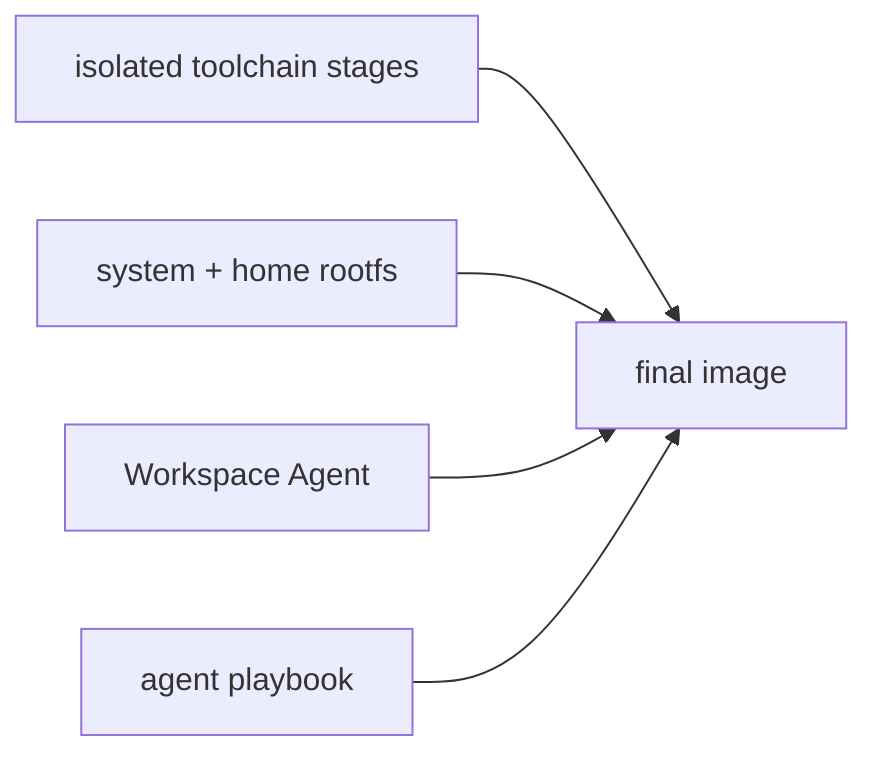
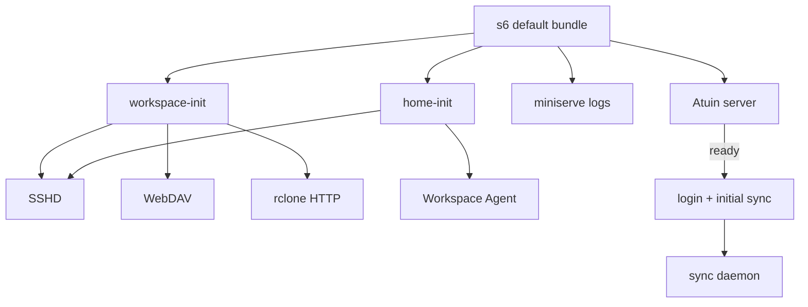
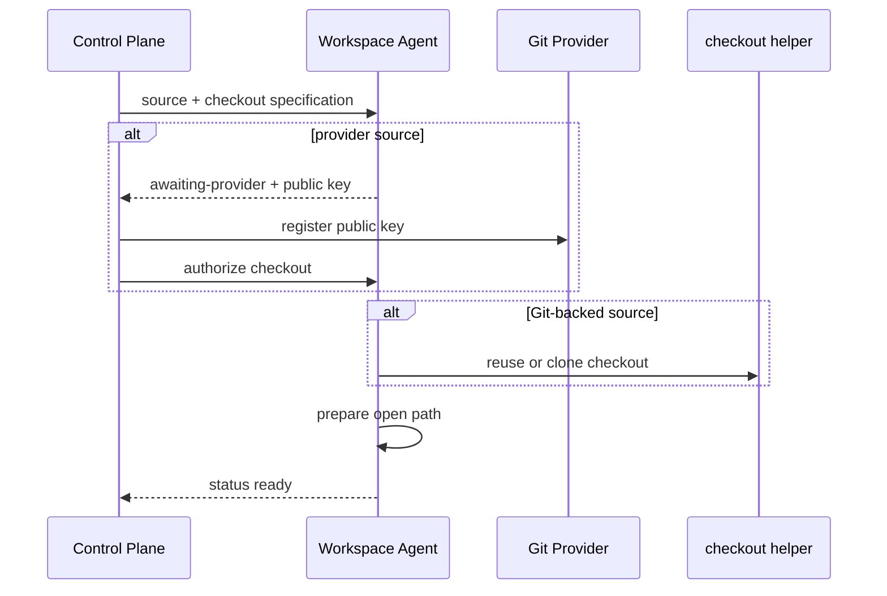

# Workspace Image Design

## Build Model

耗时且稳定的 toolchain 在独立 build stage 中生成，final stage 只复制
自包含产物。
system rootfs、Workspace Agent 和 agent playbook 按变化频率从低到高叠加，避免
日常源码变化使 toolchain layer 失效。具体工具、版本和 stage wiring 只在
Dockerfile 与 manifest 中维护。

`rootfs/` 同时拥有 system 配置、s6 definition 和 Workspace home source。重复的 editor
配置在 rootfs 内使用相对 symlink，macOS rootfs 以同路径 symlink 暴露共享 home
source。s6 database 与 container init 在 build 时生成；Service image 只复用这套
bootstrap。

Starship 与 Atuin 的 shell integration 由 standalone-binaries toolchain package
直接提供，Conda 直接加载发行版自带的 `profile.d/conda.sh`，image 不再生成用户副本。
扩展构建同时生成各 IDE 的固定绝对路径 manifest；缺少声明的扩展时构建失败。

## Startup

`workspace-init` 是数据就绪门控。它幂等准备持久目录；启用 encryption 时读取
secret，初始化或复用 gocryptfs，并挂载明文视图。运行模式由控制面
显式声明，不能根据 secret 是否存在自行切换。

`home-init` 与 Workspace 数据独立。它只准备持久化 editor state、生成或复用 deploy
key，并从 immutable template 播种 extensions。sshd 与 Agent 在它完成后启动；
shell integration 和其余 home 配置直接来自 image。

每个 IDE cache 只在不存在 installed manifest 时播种：先复制扩展，再原子发布预生成
manifest。之后扩展完全由 IDE 管理，重建容器不合并 manifest、不重新安装用户删除的
扩展。复制失败不发布 manifest，下次启动可以重试。

image 只由 control plane 启动。Agent 与 workspace-init 直接要求完整 runtime
environment；缺失 source、path 或 encryption 输入时进程失败，不进入 idle 模式，
也不使用 standalone 默认值。

## Local Services

rclone HTTP、miniserve log HTTP、WebDAV 与 Atuin listener 固定绑定 container
loopback 和各自固定端口，只允许经 Workspace SSH tunnel 或容器内进程访问。这些
file service 没有认证，不提供 bind address override。rclone HTTP 与 WebDAV 共用一个
combine remote，将 Workspace 数据、容器日志与上传目录分别暴露为 `/workspace`、
只读 `/logs` 和 `/upload`；HTTP 仅提供只读访问。miniserve 专门将 `/var/log` 映射为
只读目录，copyparty 也包含同一只读 volume，供用户检查 s6 文件日志；控制面日志接口
只读取 Podman stdout/stderr。

SSHD 固定监听 `0.0.0.0:22`。Workspace 只使用 bridge network，Host 仅在 loopback
发布每个 Workspace 唯一的 forwarding port；WSL 则通过自己的网络直接暴露 `22`。

macOS rootfs 预置固定 SSH client config、login key、known host 和 ProxyCommand
helper，并由 Host installer 按同路径安装。用户侧 alias 采用
`codespace-workspace-<host-port>_<host>_<project>_<workspace>`；helper 只解析 Host
forwarding port 与 Host，直接建立到 Host loopback listener 的 stdio tunnel，不生成
per-Workspace 配置文件。

每个 Workspace 自带 Atuin server，但数据库仍在外部。server 就绪后才执行登录和
首次同步，再启动 daemon；数据库失败不阻塞独立的 SSH 与 Agent 启动链。
credential 只进入 server 进程，不写入 home、image 或 s6 公共环境。

WSL 通过自己的 bundle 选择复用这些 service，见
[`platform/wsl/DESIGN.md`](../../wsl/DESIGN.md)。

## Agent Contract

Agent 直接要求完整 managed bootstrap input，缺失时启动失败。运行后通过 UDS 暴露
readiness、deploy public key 与只读 Git state：

checkout 对完整 repository 和已标记的 empty repository 幂等；其他既有 target
fail-fast，避免覆盖持久数据。Git state 只在 bootstrap ready 后读取。

control plane 分别持久化 Workspace 数据、交换目录、editor cache 与 control state。
encryption 只覆盖 Workspace 数据；交换目录和 cache 始终明文。Agent helper 以固定
开发用户执行，provider token 不进入 image，deploy private key 不离开 Workspace。
image home 中各 IDE 的 `bin`/`extensions` 直接链接到 `/cache`，控制面只挂载一个
cache root，不感知具体 IDE 路径。
