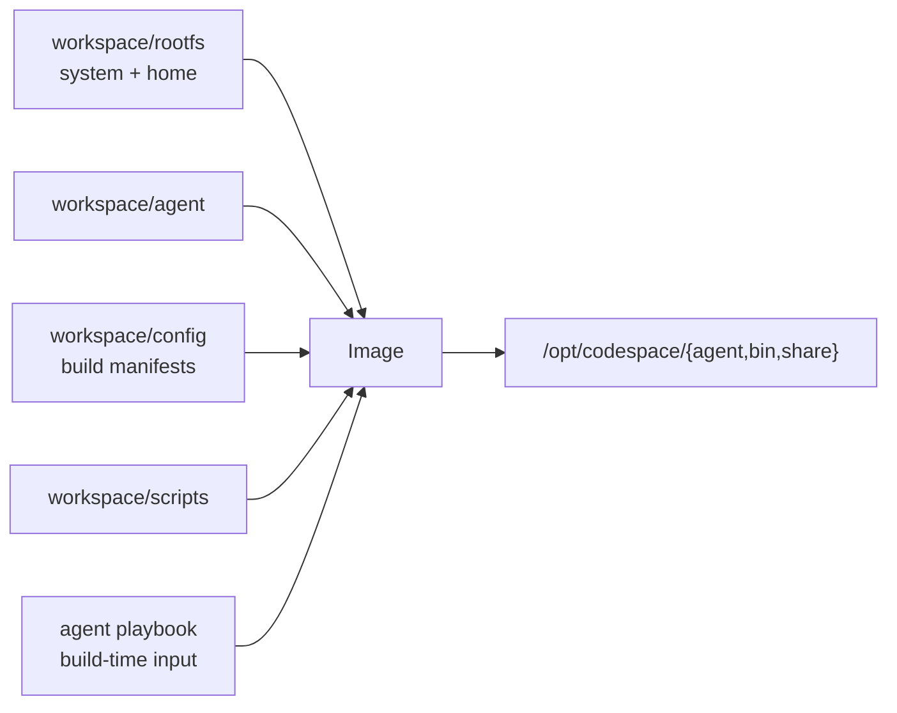
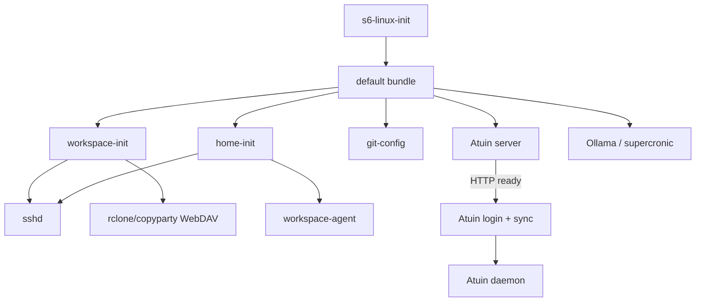
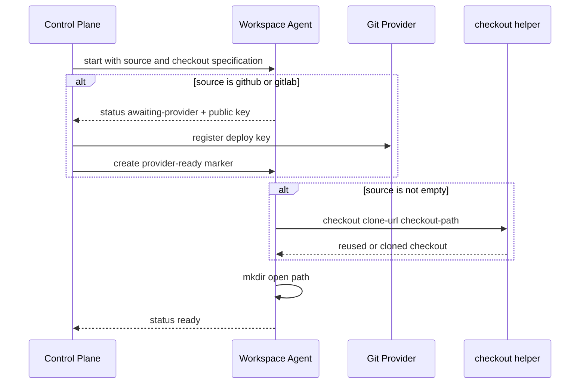

# Workspace Image Design

## Build Layout

Workspace image 使用仓库根作为 build context，但只复制声明的输入：

`rootfs/` 拥有 Workspace service、系统配置和 `home/x/` 下的镜像专属用户配置。
s6 skeleton 位于 `rootfs/etc/s6/skel/`，`scripts/install-s6.sh` 在 build 时
编译 `/etc/s6/db` 并生成 `/etc/s6/init`；Service image 只复用这两项。
Agent playbook 在 build 时合并到 `/home/x`。Workspace-owned home 配置只在
`rootfs/home/x/` 维护；重复的 Trae 配置、Workspace rule 与 remote settings 通过
相对软链接共享 canonical 文件，Host installer 也直接消费这棵 source tree。

## Startup

`workspace-init` 是 Workspace 数据就绪门控。它先以 `5230:5230`、`0700` 幂等准备
Workspace data、ciphertext root、upload 和 cache。encryption 由显式启动输入决定，镜像
独立运行时默认明文。启用时必须能读取 key secret，再初始化或复用 gocryptfs 并把明文挂到
`/workspace`；key 不可用即失败。控制面将同一 encryption 值写入 labels 供 inventory 读取。

`home-init` 不依赖 `workspace-init`。它生成 shell integration，准备各 IDE home 下
持久化的 `bin` 与 `extensions` mount，无条件生成或复用 deploy key，并从 image
template 幂等播种 editor extensions。`sshd` 与 Workspace Agent 均等待它完成。其余
Trae 配置、remote settings 与 rules 直接来自 image home，启动时不复制。

两个 WebDAV 进程通过容器环境中的 `SERVE_HOST` 配置监听地址，与推理 Service 使用相同的
配置方式；未设置时使用 `127.0.0.1`，不受 SSH listen address 影响。设置 `0.0.0.0`
可供 bridge 端口发布访问，但也会开放给同一网络的其他容器。端口保持各自固定值，
不会因修改监听地址而自动发布。

## Atuin

每个 Workspace 内运行 Atuin server，默认监听 `127.0.0.1:8002`；客户端直接使用
home 配置中的相同地址，后台同步与 SSH 手动调用不需要额外注入同步地址。
server 仍使用外部 PostgreSQL，不在 Workspace 内运行数据库。Project container 必须
挂载 root-only `atuin_db_uri` secret；读取失败或为空时 server 不启动。credential 只进入
server 进程环境，不写入 home、镜像或 s6 的公共环境目录。

s6 通过 HTTP 检查确认 server 完成启动后才执行登录和首次同步，随后启动 daemon；
就绪等待有超时，数据库失败不阻塞 SSH 与 Agent 的独立依赖链。Host-network Workspace
共享端口空间，同一 Host 上多个 server 必须配置不同监听端口及匹配的客户端地址；
bridge Workspace 则可独立使用默认端口。

多个 Workspace server 共用原有数据库，每个进程会占用数据库连接；容器越多，需要的连接
额度越高。数据库的 IPv6 出站要求不因 server 迁入 Workspace 而改变。

## Agent Protocol

Workspace Agent 绑定 control UDS，对控制面暴露 readiness、deploy public key 与只读
Git state。没有受管 Workspace bootstrap 输入时进程保持 idle，不创建 socket。受管
Workspace 的 bootstrap 流程为：

`checkout` 对已有完整 Git checkout 或已标记的 empty repository 幂等；非 Git
target 必须 fail-fast，避免覆盖持久数据。只读 Git state 只在非 empty source 且
Agent ready 时可用。

## Persistent Data

control plane 将同一 Workspace 的数据映射为：

| Container path                                       | Purpose                                |
| ---------------------------------------------------- | -------------------------------------- |
| `/workspace` 或 `/workspace.enc`                     | plaintext checkout 或 ciphertext root  |
| `/upload`                                            | WebDAV 可写交换目录                    |
| `/cache`                                             | IDE 持久数据源                         |
| `/run/codespace-control`                             | provider marker 与 Agent UDS           |
| `/home/x/.{vscode-server,trae,...}/{bin,extensions}` | `/cache` 下的 IDE runtime mount        |

Agent 子进程固定以 uid/gid `5230:5230`、`HOME=/home/x` 执行。provider token
不进入镜像，deploy private key 不离开 Workspace。
