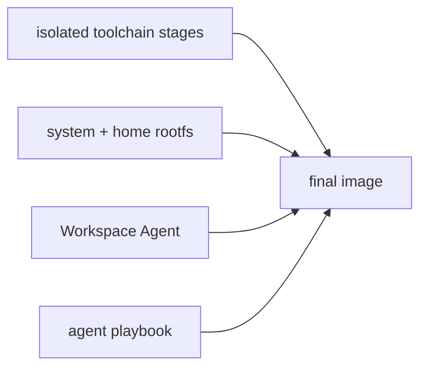
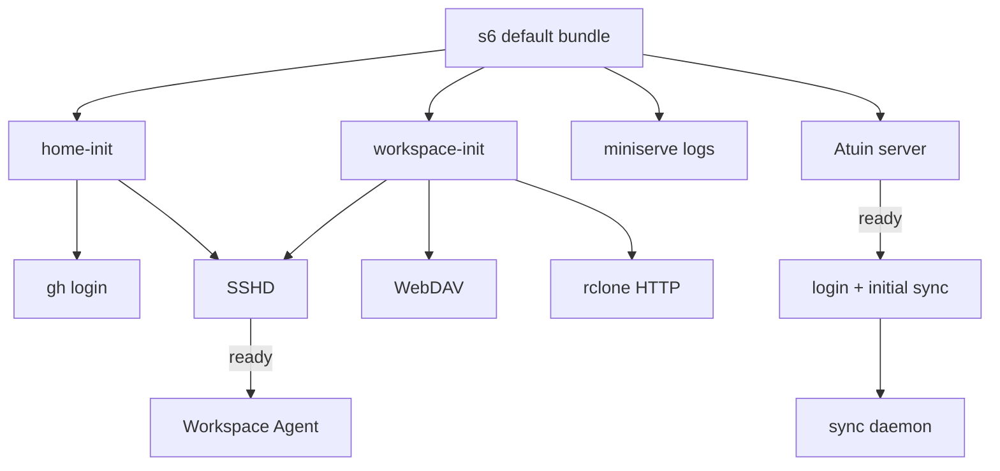
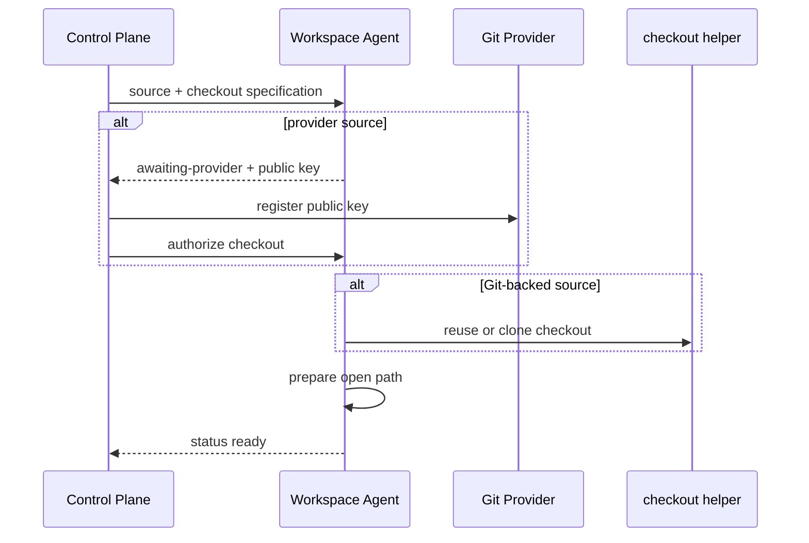

# Workspace Image Design

## Build Model

耗时且稳定的 toolchain 在独立 build stage 中生成，final stage 只复制
自包含产物。
system rootfs、Workspace Agent 和 agent playbook 按变化频率从低到高叠加，避免
日常源码变化使 toolchain layer 失效。具体工具、版本和 stage wiring 只在
Dockerfile 与 manifest 中维护。

`rootfs/` 同时拥有 system 配置、s6 definition 和 Workspace home source。重复的 editor
配置在 rootfs 内使用相对 symlink，macOS rootfs 以同路径 symlink 暴露共享 home
source。s6 database 与 container init 在 build 时生成；Service image 只复用这套
bootstrap。

final image 完成后会派生隔离的 test stage，以用户 `x` 执行镜像内 Python 验收。
test stage 直接验证最终 filesystem、权限和 runtime helper；其生成的 Workspace、
editor cache 与 deploy key 不进入发布 stage。发布 stage 通过 test marker 建立构建
依赖，因此验收失败时不能产出 image。

Starship 与 Atuin 的 shell integration 由 standalone-binaries toolchain package
直接提供，Conda 直接加载发行版自带的 `profile.d/conda.sh`，image 不再生成用户副本。
扩展构建同时生成各 IDE 的固定绝对路径 manifest；缺少声明的扩展时构建失败。

## Startup

控制面按 `container.volumes` 中使用 `${RESOURCE_DATA}` 的条目提前创建 Host bind
source 并直接挂载。加密 target 由 `container.environment.CODESPACE_ENCRYPTED_PATH`
配置，控制面与 image 使用同一个值；容器内路径遵循本 image contract：
普通模式将 `workspace/` 挂到 `/workspace`；加密模式将同一 source 挂到
`/workspace.enc`，由 `workspace-init` 读取 secret，初始化或复用 gocryptfs，
在 `/workspace` 挂出明文视图。模式由配置显式指定，缺少 secret 时失败。
`upload/` 始终直接挂到 `/upload`，业务数据与上传目录均由 image 设为 x-owned 0700。

`control/` 独立挂到 `/run/codespace-control`，`workspace-init` 保留其 Host 属主并
设为 0700，确保 SSH login UID 与容器 x 不同时仍能访问 UDS。
Agent 以 root 监听 UDS，外层私有目录控制访问。

IDE 的 `bin` 与 `extensions` 在创建容器时由 Podman 逐项 bind mount：
Host 的 `<workspace-root>/cache/<IDE>/<leaf>` 直接对应
`/home/x/<IDE>/<leaf>`。控制面提前创建 bind source；每个 Workspace 独立保存 cache，
普通删除保留、purge 随实例 root 删除。只挂载缓存叶目录，IDE 配置继续来自 image。

`home-init` 直接将 home 内的缓存目录设为 x-owned 0700，生成或复用 deploy key，
并从 immutable template 播种 extensions。`.ssh` 的布局与权限在 build 时确定，
私钥权限由 ssh-keygen 设置；运行期只在密钥缺失时生成，保留同一容器的 provider 身份。
它与 workspace-init 可独立运行，
不做 cache 路径重定向。shell integration 和其余 home 配置
直接来自 image。sshd 使用 s6-notifyoncheck 与 s6-tcpclient 报告 listener readiness，
Agent 依赖该通知，因此 bootstrap ready 同时意味着 SSH listener 已启动。

`gh-login` 在 `home-init` 后以用户 `x` 从 private secret 的 stdin 完成非交互登录。
token 不进入 argv、container environment 或 s6 environment snapshot；`gh` 将认证
状态写入当前容器的 home，容器重建时由 oneshot 重新生成。

每个 IDE cache 只在不存在 installed manifest 时播种：先复制扩展，再原子发布预生成
manifest。之后扩展完全由 IDE 管理，重建容器不合并 manifest、不重新安装用户删除的
扩展。复制失败不发布 manifest，下次启动可以重试。

image 只由 control plane 启动。Agent 与 workspace-init 直接要求完整 runtime
environment；缺失 source、path 或 encryption 输入时进程失败，不进入 idle 模式，
也不使用 standalone 默认值。

## Local Services

rclone HTTP、miniserve log HTTP、WebDAV 与 Atuin listener 固定绑定 container
loopback 和各自固定端口，只允许经 Workspace SSH tunnel 或容器内进程访问。这些
file service 没有认证，不提供 bind address override。rclone HTTP 与 WebDAV 共用一个
combine remote，将 Workspace 数据、容器日志与上传目录分别暴露为 `/workspace`、
只读 `/logs` 和 `/upload`；HTTP 仅提供只读访问。miniserve 专门将 `/var/log` 映射为
只读目录，copyparty 也包含同一只读 volume，供用户检查 s6 文件日志；控制面日志接口
只读取 Podman stdout/stderr。

SSHD 固定监听 `0.0.0.0:22`。Workspace 只使用 bridge network，Host 仅在 loopback
发布每个 Workspace 唯一的 forwarding port；WSL 则通过自己的网络直接暴露 `22`。

macOS rootfs 预置固定 SSH client config、login key 与 known host，并由 Host
installer 按同路径安装。用户侧 alias 采用
`space-{project}-{workspace}-{host}`；control plane 在 Workspace 创建成功后写入
独立 route 文件，记录实际 Host 与 forwarding port，删除容器后移除。SSH client
直接按持久 route 建立到 Host loopback listener 的 stdio tunnel，新连接不要求
control plane 运行。

每个 Workspace 自带 Atuin server，但数据库仍在外部。server 就绪后才执行登录和
首次同步，再启动 daemon；数据库失败不阻塞独立的 SSH 与 Agent 启动链。
credential 只进入 server 进程，不写入 home、image 或 s6 公共环境。

WSL 通过自己的 bundle 选择复用这些 service，见
[`platform/wsl/DESIGN.md`](../../wsl/DESIGN.md)。

## Agent Contract

Agent 直接要求完整 managed bootstrap input，缺失时启动失败。运行后通过 UDS 暴露
readiness、deploy public key 与只读 Git state：

checkout 默认 clone 完整 repository；控制面始终为 Git-backed source 传入 `args`
（无参数时为 `[]`），Agent 将其作为独立参数透传给 `git clone`。
完整 repository、shallow repository 和已标记的 empty
repository 均可幂等复用；其他既有 target fail-fast，避免覆盖持久数据。Git state
只在 bootstrap ready 后读取，直接查询工作区、HEAD 及本地引用；
空仓库、orphan branch 和 detached HEAD 均由 Git 自身处理。
Git 查询失败直接报错，不返回 clean。

control plane 分别挂载 Workspace 业务数据、交换目录、control 与各 IDE 缓存目录。
encryption 只覆盖业务数据，交换目录和 cache 始终明文。Agent helper 以固定开发用户执行，provider token
不进入 image，deploy private key 不离开 Workspace。

provider 注册成功后，control plane 通过同一个 UDS 发送幂等授权请求。Agent 的
Event 释放 checkout；确认状态写在持久 mount 外的容器可写层，使 Agent 或同一
容器重启时可继续 bootstrap，重建容器时必须重新授权。Agent 不轮询文件，
控制面不读写授权文件。未进入等待阶段或失败后的授权请求拒绝，重复授权不会
重复执行 checkout。
