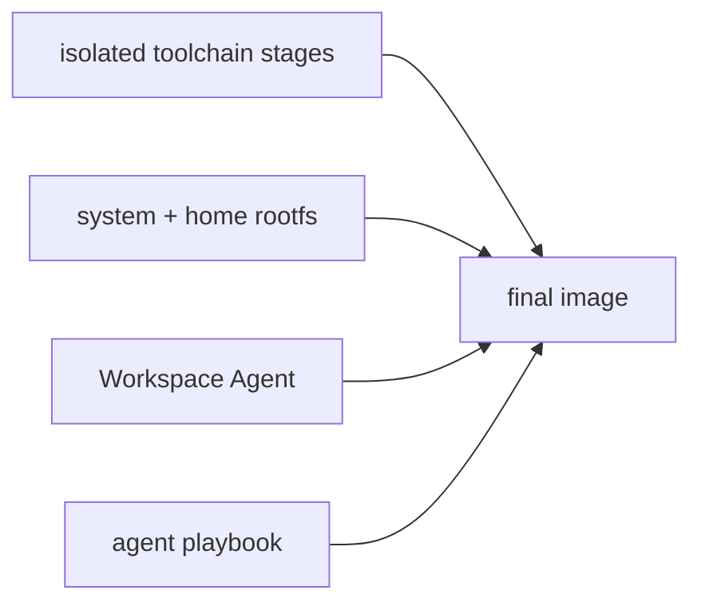
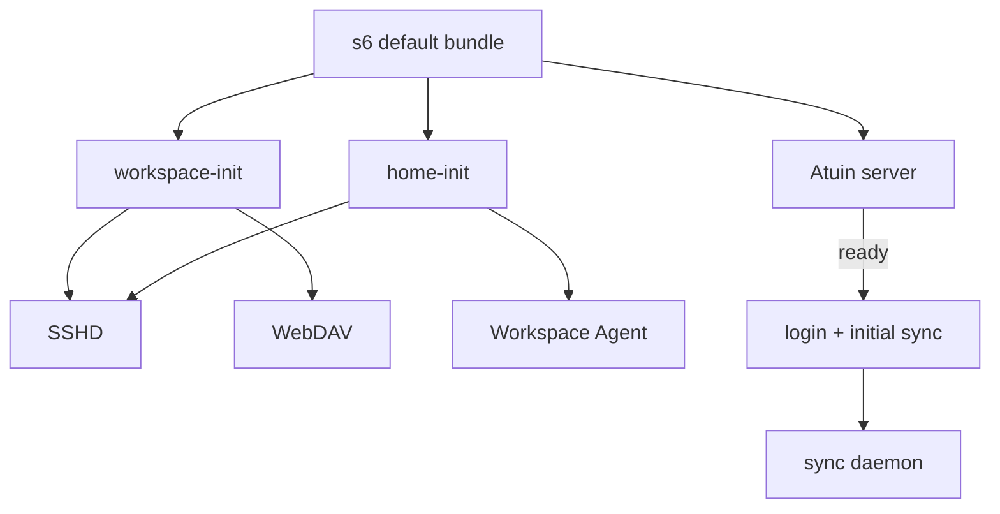
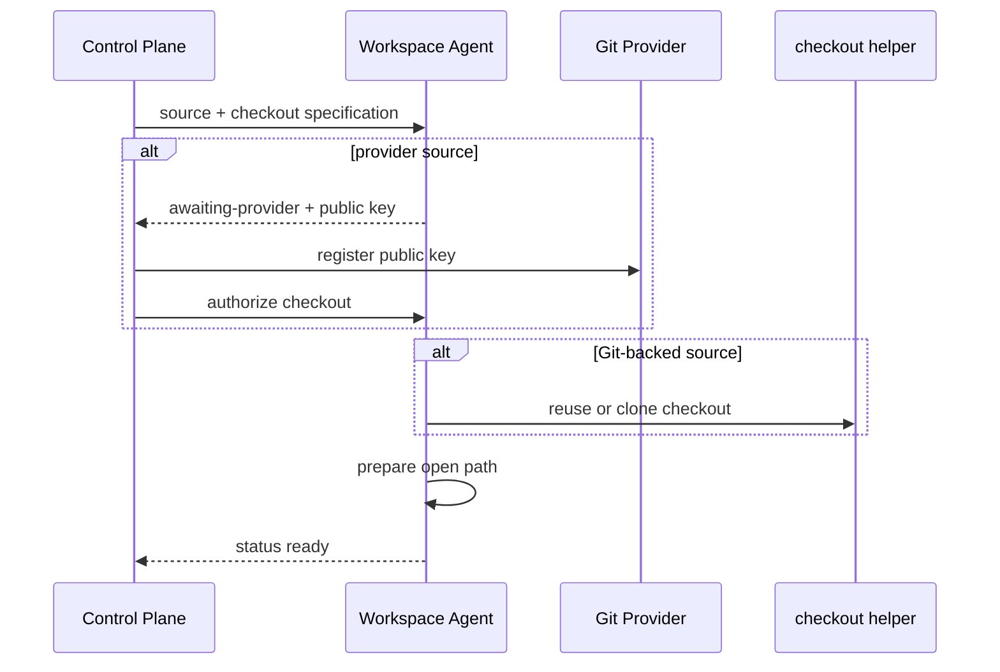

# Workspace Image Design

## Build Model

耗时且稳定的 toolchain 在独立 build stage 中生成，final stage 只复制
自包含产物。
system rootfs、Workspace Agent 和 agent playbook 按变化频率从低到高叠加，避免
日常源码变化使 toolchain layer 失效。具体工具、版本和 stage wiring 只在
Dockerfile 与 manifest 中维护。

`rootfs/` 同时拥有 system 配置、s6 definition 和 Workspace home source。重复的 editor
配置在 rootfs 内使用相对 symlink，macOS installer 直接消费可共享的 home source。
s6 database 与 container init 在 build 时生成；Service image 只复用这套 bootstrap。

## Startup

`workspace-init` 是数据就绪门控。它幂等准备持久目录；启用 encryption 时读取
secret，初始化或复用 gocryptfs，并挂载明文视图。运行模式由控制面
显式声明，不能根据 secret 是否存在自行切换。

`home-init` 与 Workspace 数据独立。它生成 shell integration、准备持久化 editor
state、生成或复用 deploy key，并从 immutable template 播种 extensions。sshd 与
Agent 在它完成后启动；其余 home 配置直接来自 image。

## Local Services

WebDAV listener 与 SSH listener 独立配置，默认只允许经 Workspace SSH tunnel 访问。
WebDAV 没有认证；将其绑定到容器接口时，部署方必须同时提供网络隔离。

每个 Workspace 自带 Atuin server，但数据库仍在外部。server 就绪后才执行登录和
首次同步，再启动 daemon；数据库失败不阻塞独立的 SSH 与 Agent 启动链。
credential 只进入 server 进程，不写入 home、image 或 s6 公共环境。

Host network 下多个 Workspace 共享端口空间，部署方必须避免 listener 冲突；bridge
模式各自隔离。WSL 通过自己的 bundle 选择复用这些 service，见
[`platform/wsl/DESIGN.md`](../../wsl/DESIGN.md)。

## Agent Contract

没有 managed bootstrap input 时，Agent 保持 idle，不创建 control socket。受管 Workspace
通过 UDS 暴露 readiness、deploy public key 与只读 Git state：

checkout 对完整 repository 和已标记的 empty repository 幂等；其他既有 target
fail-fast，避免覆盖持久数据。Git state 只在 bootstrap ready 后读取。

control plane 分别持久化 Workspace 数据、交换目录、editor cache 与 control state。
encryption 只覆盖 Workspace 数据；交换目录和 cache 始终明文。Agent helper 以固定
开发用户执行，provider token 不进入 image，deploy private key 不离开 Workspace。
