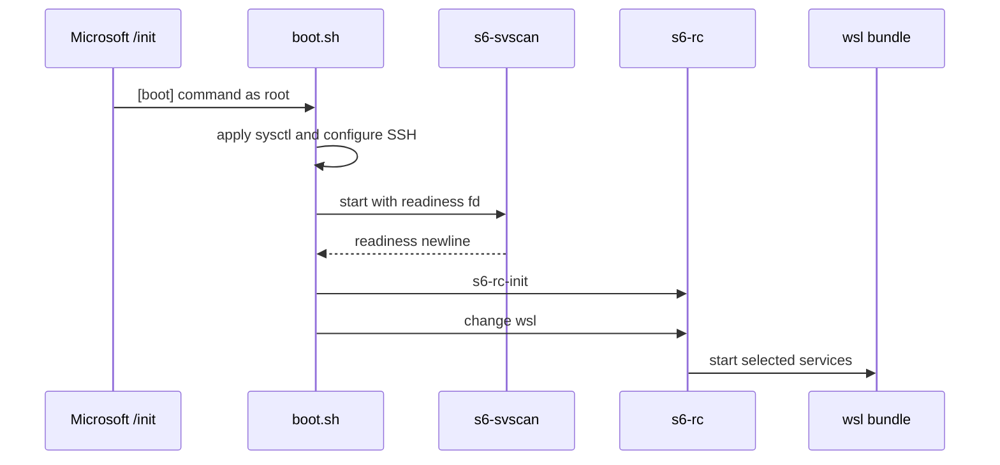

# WSL Platform Design

## Image And Export

WSL image 继承 Workspace filesystem，叠加 WSL 配置与一个最小 s6 bundle，并重新编译
service database。导出时把 OCI image 压平为 WSL 消费的 rootfs artifact：

export 会丢弃 OCI metadata，因此 image 只充当 filesystem carrier；启动 wiring 必须
位于 rootfs，不能依赖 inherited entrypoint 或 environment。

## Boot Flow

Workspace container init 只有作为 PID 1 才能工作，而 WSL 的 PID 1 固定为 Microsoft
`/init`。boot helper 因此直接建立 supervision tree，并通过 readiness fd 保证
`s6-rc-init` 在 `s6-svscan` 接管 scandir 后运行。

WSL bundle 复用 Workspace service dependency，只启动远程登录和 Host 级后台能力；
不启动需要 control plane bootstrap 的 Workspace Agent。

Atuin login 的依赖会带起本地 server。WSL 没有 Podman secret 注入，数据库
credential 必须在运行环境单独提供，不能写入导出 artifact；缺失只使 Atuin 链
失败，SSH 仍独立启动。

## Windows Integration

boot helper 只让 sshd 接受外部连接；实际 LAN 可达性由 Windows networking 决定：

- mirrored networking 直接使用 Windows LAN address。
- NAT 模式使用 `netsh interface portproxy` 并配置 firewall。

`[boot] command` 启动的 service 不构成 WSL keep-alive。优先通过 WSL global config
禁用 idle 回收；不支持时，由 Windows Scheduled Task 持有 distribution 会话。
