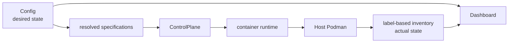
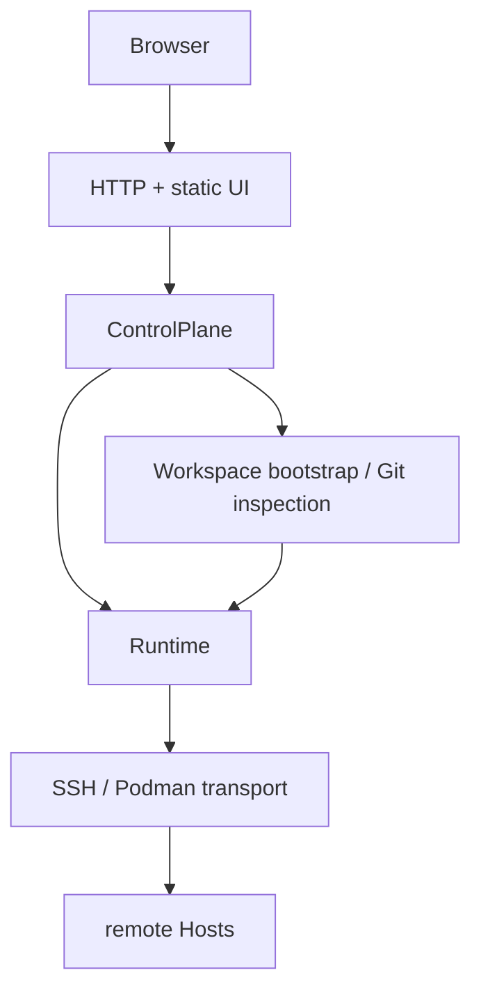
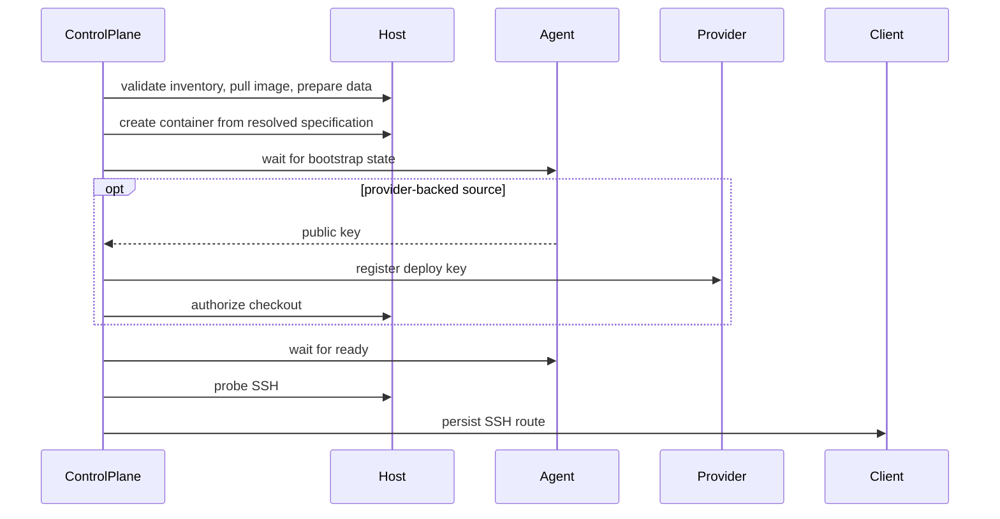

# Codespace Control Plane Design

## State Model

Config 只表达创建目标和 placement，Podman inventory 是实际运行状态的唯一来源。
Workspace 与 Service 使用不相交的 inventory kind；Dashboard 不缓存容器状态，
也不以 desired value 填补实际容器字段。

Resource 是 Host 上的操作目标：Service 由 Host 与 name 定位，Workspace 还包含
Project。kind、内部 identity、容器名和 ownership labels 都从同一个 Resource 派生，
名称与 Host 校验类型也在该模块定义。每个领域的 desired Spec 与 deployed model
共用 Metadata 字段和身份属性，但 Spec 独有 container input，deployed model 独有
container ID 和实际状态。

创建时，同一个 resolved specification 同时生成 identity、labels 与 runtime input。
之后会影响删除、安全判断和用户入口的 deployed metadata 均从 labels 恢复，
不与当前 Project 配置合并。缺失、冲突或无法验证的 metadata 直接失败；
内部 identity 与 deploy key title 使用 `space:{project}/{workspace}@{host}`，
分隔符不属于资源名，确保身份无歧义。容器名只在 Host 内定位，使用
`space-{project}-{workspace}`，SSH Host forwarding port 由容器名确定性派生。
名称不用于拆解字段，创建时拒绝同 Host 重名和端口冲突，inventory 校验实际名称与
labels 一致。部署契约变化通过重建容器生效。

## Boundaries

Web boundary 只负责输入输出、后台任务提交和错误映射，并将领域 URL 转成 Resource。
ControlPlane 统一排队、部署、删除、日志、隧道和 failed operation dismiss，
Config 在统一入口验证 placement。生命周期通过具体 Spec 区分必要的行为，
不引入插件注册表或继承式 Manager。runtime 只处理容器、Host 与 transport primitives，
不读取 Config。Workspace 模块只编排 source bootstrap、Agent readiness 和 Git inspection。

ControlPlane 持有 transport、operation store 与受锁保护的进程内 token，并聚合
领域 inventory，不导入 Web model。Service 模块与 Workspace package 分别拥有
对应的 specification、deployed metadata 与 label 读取逻辑。
Dashboard 在 Web 层直接将已验证的 inventory、Config、operation 与 token presence
投影为响应；简单结果使用原生 mapping，输入与外部协议仍在边界验证。
单 Host 采集失败保留明确
的 failure，不伪造空 inventory：SSH transport failure 标记 offline，其他采集错误
标记 error，数量保持未知。其他 Host 的结果仍可展示。

只有明确的 ResourceNotFound / ResourceConflict 映射到 HTTP 404 / 409。
metadata 缺失、协议错误和其他意外异常返回 500，不根据 Python 通用异常类型
推测业务含义。

operation state 只存在于单个控制面进程中。成功后记录消失，失败时保留
阶段与 cause chain，便于用户检查现场并显式 dismiss；ControlPlane 不做隐式回滚。
所有资源共用一个 OperationStore，key 为 Host 与 Resource identity；同名的不同 kind
以及不同 Host 彼此隔离。

Transport 为每个 Host 维护一个 authenticated OpenSSH ControlMaster，并在其上
复用 Podman socket 与 Agent UDS forwarding。初始 SSH handshake 跨 Host 串行，
避免共享认证链并发竞争；连接建立后的 Host 操作可并发。Workspace TCP tunnel
使用独立 SSH connection，并随目标容器 identity 变化、Workspace 删除或控制面
关闭而释放。

Host socket forward 与 TCP forward 共用 SSH 进程启动、readiness 和失败清理流程。
Podman SDK 负责 API 与容器对象；其内置 SSH adapter 显式关闭 host key verification，
不能用于这里的 trust contract。保留 system OpenSSH 也使 ProxyJump 和共享认证链保持
同一个实现来源。配置与协议校验复用 Pydantic，Web 使用 FastAPI，Agent 的
HTTP-over-UDS 使用 HTTPX 原生 UDS transport，容器与 SSH readiness 重试使用 Tenacity。

Workspace image 与 Host installer 共同预置固定 SSH trust contract。Workspace SSH
alias 为 `{container_name}-{host}`，`space-` 前缀不允许用于真实 Host。每次成功创建
Workspace 后，bootstrap 将 deployed Host 与 forwarding port 原子写入
`~/.ssh/codespace/workspaces/{alias}`；删除容器后移除同一文件。静态 SSH config
include 这些独立 route，连接时直接经 Host 跳转到其 loopback listener，不访问
control plane。不同 Workspace 不共享可变文件，因此并发 lifecycle operation
不需要 SSH config 全局锁。

route 是从已部署 Workspace metadata 生成的持久连接入口，不是容器 inventory 或
desired state。控制面不从 route 恢复资源，也不接受 route 作为删除、安全判断或
Dashboard 状态的输入。内部探测和隧道继续使用已知 transport route，不依赖持久
route 文件。控制面不安装或改写 SSH key、known hosts 与顶层 client config。

## Placement And Container Contract

所有 Workspace image 引用都必须是 `platform/container/workspace` contract 的兼容
构建。控制面不探测 image capability，也不为其他 image 维护 fallback；固定
filesystem、home、Agent、SSHD 与 local service 布局由 image 在构建期提供，控制面
只注入 placement 和单 Workspace runtime input。

`config.ContainerLayer` 表达 YAML 中的 container 覆盖层，从通用层逐步覆盖到具体
placement；未指定或 `null` 的字段不参与 merge，list 与 mapping 整体替换，显式
空集合清空继承值。字段校验在每层解析时执行，跨字段约束在 merge 后执行。
Project image、platform 和 tunnel allowlist 各自按其 resolver 处理，不隐式套用
container merge 规则。

Config resolver 输出 `runtime.container.ContainerSpec`，集合字段始终为确定的
list 或 mapping，network mode 必须确定；runtime 不接收覆盖层，也不执行 merge。
未指定的可选 Podman scalar option 保持 `None`，由调用边界决定是否传入。
Project 使用 `WorkspaceContainerSpec` 将 network mode 固定为 bridge，解析出其他
模式直接失败。lifecycle 追加实例输入后仍须满足同一 Spec 约束。

配置仅接受控制面实现的 Compose service syntax 子集。runtime 接收完全解析后的
绝对 bind mount，不实现通用 variable interpolation。Service 的 managed data
placeholder 在 Service 领域边界解析；Project 不能使用它，也不能覆盖 Workspace
保留的 runtime input。

## Networking And Access

Workspace 固定使用 Podman 默认 bridge network，控制面不创建网络或依赖容器 DNS。
其 SSHD 固定监听容器内 `0.0.0.0:22`，并以每个 Workspace 唯一的端口发布到 Host
loopback。需要被 Workspace 访问的 Service 则显式发布到 Host bridge gateway。
公网或 LAN 暴露不属于默认行为，必须由部署配置明确选择。

Web UI 的 Workspace port 入口不要求额外 Podman port publication。控制面先复用到
Host 的认证连接，再通过 Workspace SSH 将 allowlist 中的容器 loopback port 映射到
本机临时 loopback listener。allowlist 属于当前 Project desired config，不写入容器
metadata；未列出的端口拒绝转发，隧道只在控制面进程存活期间有效。

Host 的 DNS、bridge gateway 和 IPv6 出站能力属于基础设施前提。容器网络
配置变化不会迁移既有容器。

## Persistent State

每个 Host 的受管数据根分为 Workspace 与 Service 两棵目录。每个 Workspace 再隔离
业务数据、交换数据、editor cache 和 private control state；Service 只拥有自己的
managed data。具体路径由 runtime model 唯一生成，调用方不得拼接第二套布局。

普通 Workspace 直接挂载业务数据；加密 Workspace 将同一 Host 目录作为 ciphertext
root，明文视图由 image 启动链提供。交换数据和单一 cache root 始终明文，具体 IDE
cache 路径由 image home 的 symlink 定义。control state 保存 provider readiness 与
Agent UDS，权限必须保持私有。

provider token 只留在控制面内存。deploy key pair 在 Workspace 内生成，控制面
只读取 public key 并向 provider 注册；Service 不得接触 Workspace credential。

## Workspace Lifecycle

创建失败保留已经产生的容器、Host 数据与 provider side effect，operation 进入
failed。删除确认前通过只读 deletion check 读取 repository state；停止的容器不会
为检查而自动启动。检查失败明确显示风险，用户仍可显式确认删除。DELETE 只执行
已确认的删除，不兼任查询，也不使用 force 参数切换职责。provider key 必须先成功
撤销，之后才允许删除容器或数据；容器删除后移除本地 SSH route。

Agent 响应在 HTTP client 边界严格校验，状态类型表达各阶段必需的数据；lifecycle
只使用已经验证的结果，不补公钥、错误原因或 Git 状态。Git 字段缺失不能解释为
repository clean。empty Workspace 的检查结果在对应分支显式构造，删除结果不携带
虚构的 Git state。
启动等待只重试 Agent 暂不可达并等待正常状态推进；协议错误与 failed 状态立即失败，
不改用默认结果继续执行。HTTP 拒绝原因只读取 Agent 的固定 error response contract。
每次请求在 context manager 内流式读取，响应超过 64 KiB 立即失败；成功、超限、
读取失败和进程中断均释放 response 与 client。客户端不使用环境代理或隐式 HTTP 重试。
状态等待保留单一 deadline，在正常进展或暂不可达时轮询，不将协议错误交给重试器。

Service apply 是 replace reconciliation：拉取 desired image、准备 managed data、
删除确定性旧容器并按当前 spec 重建。普通 remove 保留数据，purge 才删除
managed data。

## Maintenance

维护命令先跨 Host 或 provider 收集完整计划，再由显式 apply 执行。
单目标失败不阻断其他目标，但必须进入最终汇总；维护逻辑直接复用
Config、inventory、provider 与 runtime primitives，不经过 HTTP。

计划使用领域记录保存已决定的目标与操作，执行器不重新遍历 Config 扩展目标。
secrets 的 create / replace 与值在计划阶段确定；执行前发现存在性与计划不符时
报告失败，不切换操作。扫描失败的 Host 不进入执行阶段，secret 值不进入计划展示
或 repr。
