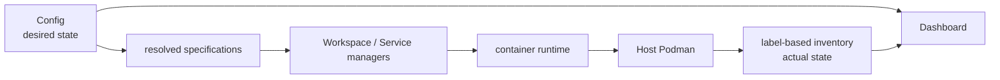
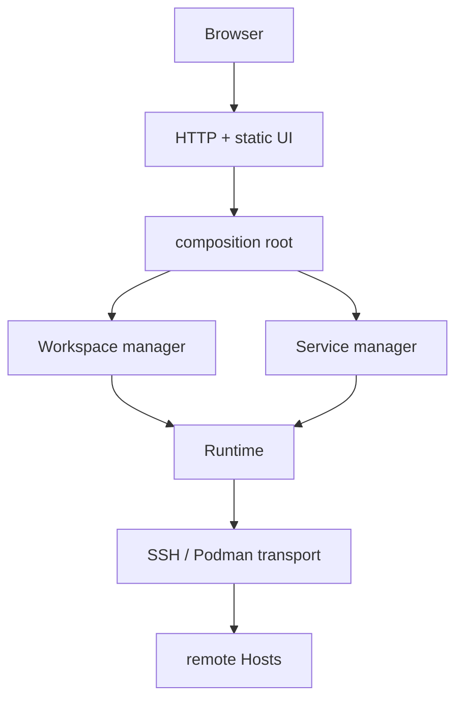
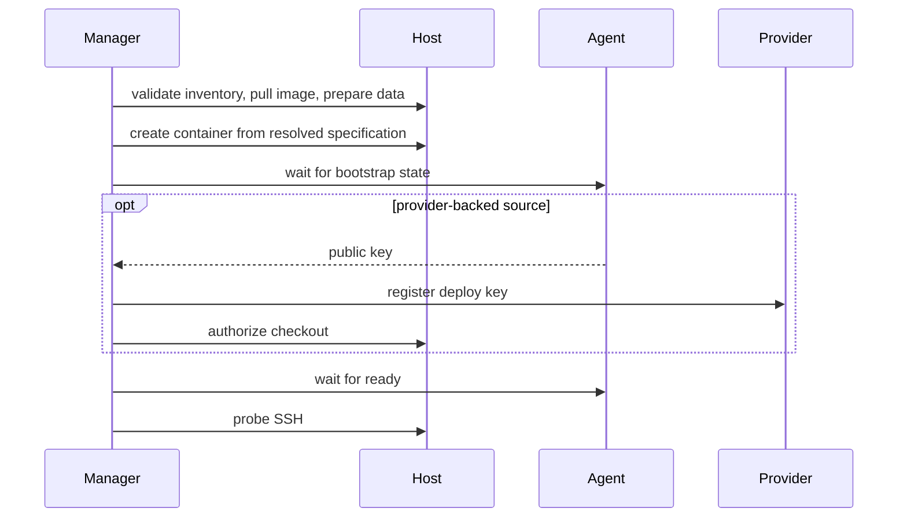

# Codespace Control Plane Design

## State Model

Config 只表达创建目标和 placement，Podman inventory 是实际运行状态的唯一来源。
Workspace 与 Service 使用不相交的 inventory kind；Dashboard 不缓存容器状态，
也不以 desired value 填补实际容器字段。

创建时，同一个 resolved specification 同时生成 identity、labels 与 runtime input。
之后会影响删除、安全判断和用户入口的 deployed metadata 均从 labels 恢复，
不与当前 Project 配置合并。缺失、冲突或无法验证的 metadata 直接失败；
identity 与 SSH Host forwarding port 只由已验证的 Host、Project、Workspace 三元组
派生，契约变化通过重建容器生效。identity 使用资源名中禁止出现的 `_` 分隔字段，
不能用 `-` 拼接这些允许包含连字符的值。

## Boundaries

Web boundary 只负责输入输出、后台任务提交和错误映射。两个 manager 分别编排
自己的领域流程，不相互调用；runtime 只处理容器、Host 与 transport primitives，
不读取 Config。

operation state 只存在于单个控制面进程中。成功后记录消失，失败时保留
阶段与 cause chain，便于用户检查现场并显式 dismiss；manager 不做隐式回滚。

Transport 为每个 Host 维护一个 authenticated OpenSSH ControlMaster，并在其上
复用 Podman socket 与 Agent UDS forwarding。初始 SSH handshake 跨 Host 串行，
避免共享认证链并发竞争；连接建立后的 Host 操作可并发。Workspace TCP tunnel
使用独立 SSH connection，并随目标容器 identity 变化、Workspace 删除或控制面
关闭而释放。

Workspace image 与 Host installer 共同预置固定 SSH trust contract。Workspace SSH
alias 编码 Host forwarding port、Host、Project 与 Workspace；静态 ProxyCommand
直接解析前两项并经 Host 跳转。控制面不安装 key，也不生成、解析或改写本地 SSH
文件。

## Placement And Container Contract

所有 Workspace image 引用都必须是 `platform/container/workspace` contract 的兼容
构建。控制面不探测 image capability，也不为其他 image 维护 fallback；固定
filesystem、home、Agent、SSHD 与 local service 布局由 image 在构建期提供，控制面
只注入 placement 和单 Workspace runtime input。

container 配置从通用层逐步覆盖到具体 placement；只有显式字段参与 merge，
list 与 mapping 整体替换。Project image、platform 和 tunnel allowlist 各自按其
resolver 处理，不隐式套用 container merge 规则。Project 最终解析为
`WorkspaceContainerSpec`，network mode 固定为 bridge；任何层解析出其他模式都直接
失败。

`ContainerSpec` 只接受控制面实现的 Compose service syntax 子集。runtime 接收完全
解析后的绝对 bind mount，不实现通用 variable interpolation。Service 的 managed data
placeholder 在 Service 领域边界解析；Project 不能使用它，也不能覆盖 Workspace
保留的 runtime input。

## Networking And Access

Workspace 固定使用 Podman 默认 bridge network，控制面不创建网络或依赖容器 DNS。
其 SSHD 固定监听容器内 `0.0.0.0:22`，并以每个 Workspace 唯一的端口发布到 Host
loopback。需要被 Workspace 访问的 Service 则显式发布到 Host bridge gateway。
公网或 LAN 暴露不属于默认行为，必须由部署配置明确选择。

Web UI 的 Workspace port 入口不要求额外 Podman port publication。控制面先复用到
Host 的认证连接，再通过 Workspace SSH 将 allowlist 中的容器 loopback port 映射到
本机临时 loopback listener。allowlist 属于当前 Project desired config，不写入容器
metadata；未列出的端口拒绝转发，隧道只在控制面进程存活期间有效。

Host 的 DNS、bridge gateway 和 IPv6 出站能力属于基础设施前提。容器网络
配置变化不会迁移既有容器。

## Persistent State

每个 Host 的受管数据根分为 Workspace 与 Service 两棵目录。每个 Workspace 再隔离
业务数据、交换数据、editor cache 和 private control state；Service 只拥有自己的
managed data。具体路径由 runtime model 唯一生成，调用方不得拼接第二套布局。

普通 Workspace 直接挂载业务数据；加密 Workspace 将同一 Host 目录作为 ciphertext
root，明文视图由 image 启动链提供。交换数据和单一 cache root 始终明文，具体 IDE
cache 路径由 image home 的 symlink 定义。control state 保存 provider readiness 与
Agent UDS，权限必须保持私有。

provider token 只留在控制面内存。deploy key pair 在 Workspace 内生成，控制面
只读取 public key 并向 provider 注册；Service 不得接触 Workspace credential。

## Workspace Lifecycle

创建失败保留已经产生的容器、Host 数据与 provider side effect，operation 进入
failed。删除 Git-backed Workspace 前通过 Agent 读取 repository state；停止的
容器不会为检查而自动启动。provider key 必须先成功撤销，之后才允许
强制删除容器或数据。

Service apply 是 replace reconciliation：拉取 desired image、准备 managed data、
删除确定性旧容器并按当前 spec 重建。普通 remove 保留数据，purge 才删除
managed data。

## Maintenance

维护命令先跨 Host 或 provider 收集完整计划，再由显式 apply 执行。
单目标失败不阻断其他目标，但必须进入最终汇总；维护逻辑直接复用
Config、inventory、provider 与 runtime primitives，不经过 HTTP。
