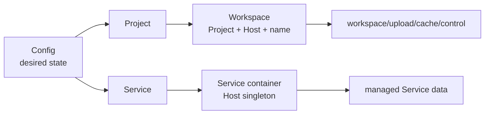
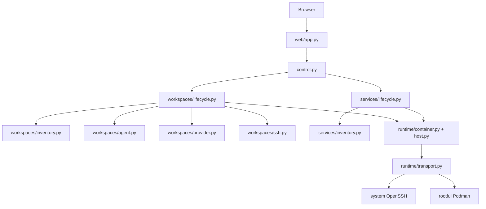
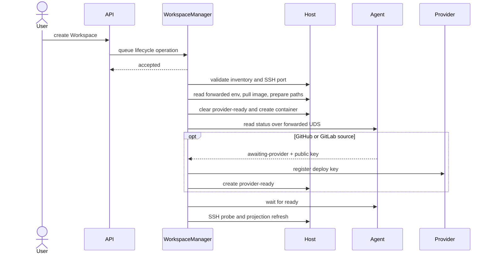
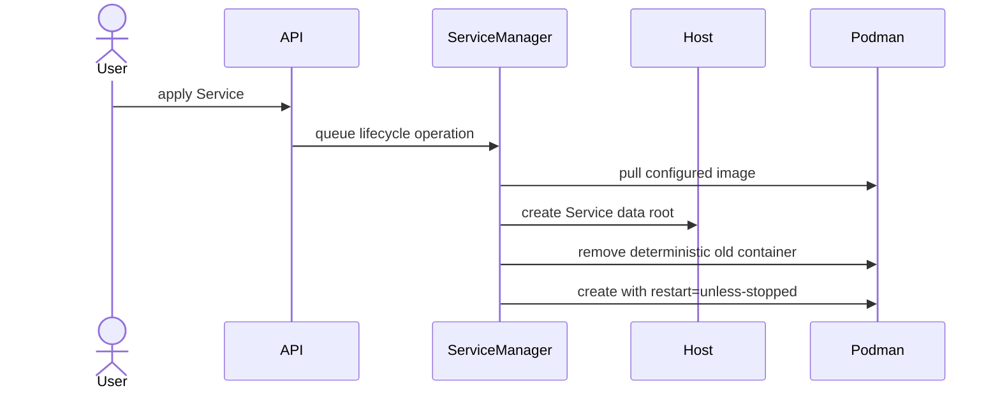

# Codespace Control Plane Design

## Domain Model



- **Project**：声明 source、Workspace image、可用 Host 与容器参数的配置蓝图。
- **Workspace**：Project 在一个 Host 上的具名持久副本及其运行容器。
- **Service**：配置选择在一个或多个 Host 上运行的单例常驻容器。
- **Host**：通过 SSH 访问并提供 rootful Podman 的执行节点。
- **Operation**：单进程内的短期 lifecycle 状态，进程重启后丢弃。

Podman inventory 是实际运行状态的唯一来源。Config 只表达期望形态，Dashboard 不缓存容器状态。
Workspace 与 Service 通过 `codespace.kind` 使用不相交 inventory filter。

## Container Metadata

创建时由同一个 resolved spec 生成容器 labels、environment 和 mounts。已有 Workspace
的 source、repository、image、platform、SSH port、open path 与 encryption 均读取 labels，
不与当前 Project 配置合并。Podman 原生 list 和 inspect 的状态结构在 runtime 边界统一读取，
不追加逐容器 inspect，也不把缺失状态伪装为正常值。

Source 的 Pydantic 判别联合由 Workspace 领域拥有，Config、resolved spec、inventory 与 Web
共用；repository 和 URL 只存在于对应 Source 分支。容器边界将 Source 映射到 labels 和
启动 environment，读 inventory 时恢复并校验同一模型。Dashboard 复用 Workspace 字段并
计算 SSH command 与编辑器链接，不再维护第二份 Workspace 字段定义。

Dashboard 的 Project 与 Service placement 仍表达 Config 中的创建目标；Service placement
分别携带 desired image 与可空的实际 container，不用期望镜像填补实际 inventory。Host 是否
离线仅由 Host status 表达。Workspace 编辑器链接使用容器记录的 open path，删除时根据
容器记录的 source 与 repository 检查 Git state、撤销 deploy key。

按名称执行生命周期操作时，一次 inspect 同时取得容器并核验 kind 与资源 identity labels。
不先扫描全 Host 再按名称查询同一个容器。SSH port 冲突检测仍使用 Host inventory。
必需 label 缺失即拒绝读取；部署新契约需重新创建容器，不提供旧契约解析或补齐逻辑。

## Components



`PodmanTransport` 是 Podman clients、per-Host OpenSSH ControlMaster、UDS forwards 和
按需 TCP tunnels 的唯一 owner。
ControlMaster 的初始 SSH handshake 跨 Host 串行执行，避免共享 ProxyJump 的并发 GSSAPI
认证竞争；连接建立后的 Host 操作保持并发。Manager 只接收 Config 解析出的 immutable spec，
不解析 YAML。FastAPI route 只做输入输出和错误映射。
OperationStore 的执行上下文统一保留失败和清理成功记录；Manager 只编排各自的业务步骤。
日志 route 直接返回 runtime 的 LogSnapshot，由 FastAPI 序列化。

## Placement Resolution

Project 按以下顺序按字段覆盖：

```text
project_defaults.container
  -> hosts.<host>.container
  -> projects.<project>.container
  -> projects.<project>.hosts.<host>.container
```

Service 按以下顺序按字段覆盖：

```text
hosts.<host>.container
  -> services.<service>.container
  -> services.<service>.hosts.<host>.container
```

Host container 是该 Host 上 Project 与 Service 共用的默认层。Project image 仍按
`project_defaults -> projects.<project> -> projects.<project>.hosts.<host>` 覆盖；platform 按
`hosts.<host> -> projects.<project>.hosts.<host>` 覆盖。list 与 mapping 都整体替换。
`ContainerSpec` 只接受控制面实际支持的 Compose service syntax 子集，已接受的字段保持 Compose
语义；唯一例外是 Service volume source `${SERVICE_DATA}`。volume 限定为 absolute bind short
syntax、bind long syntax 和这个受控 placeholder。Config 启动时验证 Host 引用、network mode、
port 使用、保留 env 和保留 mount；除此之外不实现 Compose variable interpolation，并拒绝
container 字符串值中的 `$`。

## Container Networking

bridge 模式直接使用 Podman 默认网络，控制面不创建或修改网络，不依赖容器 DNS。
Workspace 通过 `host.containers.internal` 访问 Service 的 Host 发布端口。Linux 上
Host loopback 发布端口不能被 bridge 容器访问；需要在配置中显式绑定 Host 的实际
bridge 网关地址，不要绑定所有外网接口。Host 本身与 SSH tunnel 也使用该发布地址。
发布前该网关接口必须已存在；空 Host 上仅有 Podman network 配置不代表接口已创建。

Service 监听容器接口；Workspace SSH 保持 Host loopback 发布。WebDAV 默认监听
Workspace loopback 并通过 Workspace SSH forwarding 访问，可显式配置监听地址；
端口发布仍由 container 配置独立声明。Web UI 按需建立通往 Workspace 的 SSH 连接，
通过 Host 已认证的 ControlMaster 转发，使用 inventory 中的 SSH metadata 和受管身份验证。
可打开的端口由 Project 配置继承默认列表或整体覆盖，空列表关闭入口；它属于控制面的
访问配置，不是容器 metadata，不写入 labels，重启控制面即可生效。未配置的端口拒绝转发。
本地 TCP listener 只绑定 loopback，SSH 就绪后通过 HTTP redirect 打开目标端口，
不做业务协议探测。每个端口独立复用连接，连接退出或容器 identity 变化后重新创建；
删除 Workspace 和关闭控制面时统一释放。隧道只存在于控制面进程生命周期内，
浏览器须与控制面运行在同一台机器。

Atuin server 与客户端同处 Workspace，使用容器 loopback 通信，不发布 Host 端口。
数据库 secret 由 Project container 挂载，support Service 只负责镜像维护，不接收它。
客户端与 macOS 共用的基础配置使用 loopback 地址，不依赖 SSH shell 注入环境变量。

默认 bridge 的 DNS 与 IPv6 能力由 Host 管理。只有 AAAA 记录的数据库要求现有网络具备
IPv6 出站，或改用数据库提供的 IPv4 endpoint；端口发布不能解决该出站限制。
容器配置变化需要重新创建容器，不自动迁移运行中的容器。

## Host Data

```text
$HOME/codespace/
├── workspaces/
│   └── <project>/<workspace>/
│       ├── workspace/
│       ├── upload/
│       ├── cache/
│       └── control/
└── services/
    └── <service>/
```

普通 Workspace 把 host `workspace/` bind 到 `/workspace`。加密 Workspace 把同一路径 bind 到
`/workspace.enc`，由镜像内 gocryptfs 挂载明文 `/workspace`。`upload/`、`cache/` 与 IDE runtime
目录始终明文。`control/` 权限为 `0700`，保存 provider readiness 与 Agent UDS。

Service 不拥有 Workspace mount、SSH 投影或 repository credential。Service volume 可用
`${SERVICE_DATA}` 引用自己的 managed data root，Host source 由控制面根据 Service identity
生成；Project 不允许使用这个 placeholder。Config 启动时校验 source，Service 在创建前
将自己的 placeholder 解析为绝对路径；runtime 不认识 Service placeholder，只接受绝对路径
mount。Container secret 遵循 Compose file mount 语义；
需要环境变量的进程由镜像启动逻辑读取 secret 文件后注入。

## Workspace Create



失败不回滚。容器、provider key 和 Host 数据保留，operation 进入 `failed` 并携带 cause chain。

## Workspace Delete

Git-backed Workspace 默认通过 Agent 做只读 Git state 预检。停止状态不会被启动用于检查；
调用方必须显示数据丢失风险后显式强制删除。Provider key 撤销必须先成功，之后才允许
删除容器或数据；是否清理完整 Workspace 数据由调用方明确选择。

## Service Apply



重复 apply 收敛到当前配置。remove 默认只删容器，显式 purge 才删除 managed Service data。

## Workspace Agent

Agent 只监听 Workspace control UDS，向控制面提供 bootstrap readiness、deploy public key
与只读 Git state。控制面只传 source 与 checkout specification，不传 provider token；
private key 不离开 Workspace。Agent ready 后控制面仍执行完整 SSH 登录探测。

## Maintenance

维护命令先跨 Host 或 repository 生成完整计划，再由显式 apply 执行。单个目标失败必须隔离并进入
最终错误汇总；维护逻辑直接复用 Config、inventory、provider、Host 和 Podman 原语，不经过 HTTP。
